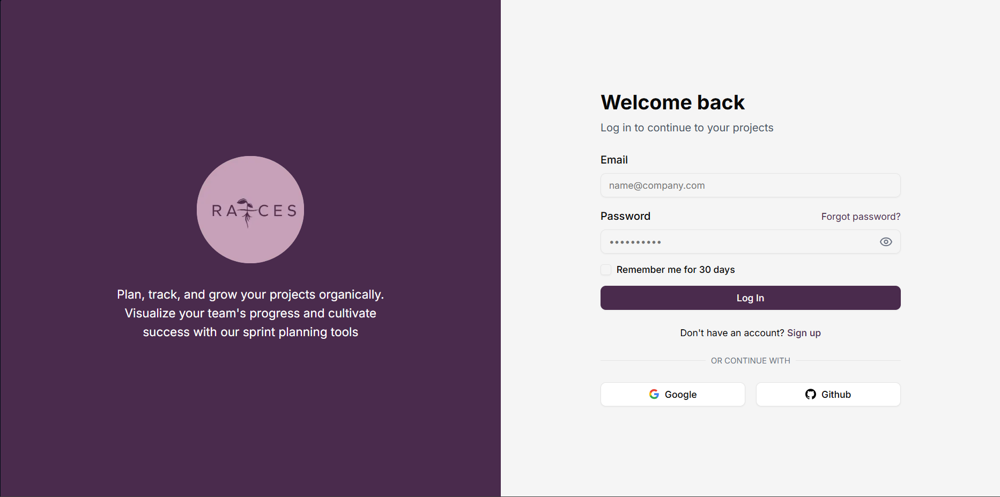
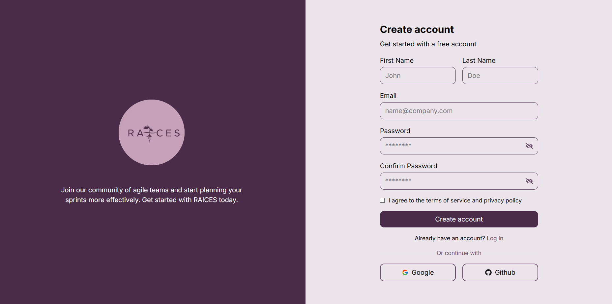
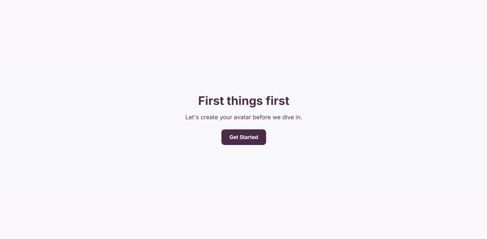
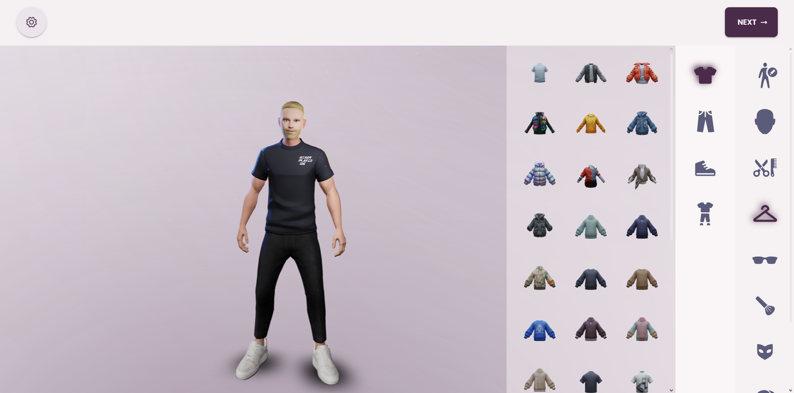
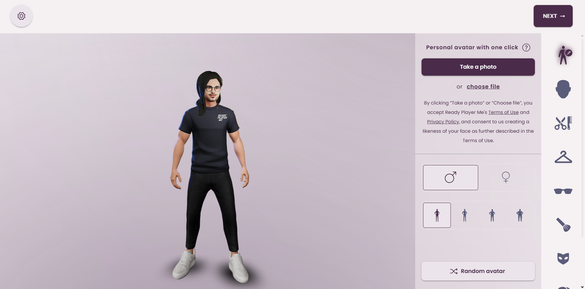

## Creación de una cuenta en la plataforma

Para poder ingresar a la plataforma es necesaria la creación de una cuenta, para esto tendrá que registrarse dentro de esta. La plataforma admite la creación de una cuenta a partir de una dirección de correo o tambien podrá registrarse usando su cuenta de Google o Github. Una vez se haya registrado recibirá un corre de confirmación para activar su cuenta dentro de la plataforma. Una vez tenga su cuenta activada podrá ingresar a la plataforma.

### Proceso de creación de cuenta
Pantalla inicial

Seleccione la opción la opción de "**_Sign up_**"

Pantalla de registro

Rellene el formulario de registro y presione "**_Create account_**", debería recibir un correo con un enlace de verificación. Tras la verificación, tendrá acceso a su cuenta y podra inciar sesión normalmente.

## Creación de un avatar

Como parte de nuestras funcionalidades adicionales, podrá personalizar un avatar virtual que le represente dentro de su equipo de trabajo y mediante el cuál podrá ver representado su estado de ánimo a futuro.

### Proceso de creación de avatar
Tras iniciar sesión por primera vez, debería poder ver la siguiente pantalla:

De click en "**_Get Started_**"

Pantalla de personalización de avatar

Dentro de esta pantalla usted verá un avatar generado aleatoriamente el cuál usted podrá personalizar a su gusto, de igual manera usted cuenta con la capacidad de tomar una foto o importar una foto para personalizar su avatar. Para eso usted necesita darle permiso a la página de acceder a su cámara o archivos.

Cuando haya terminado de personalizar la apariencia de su avatar de click en "**_Next_**"

:::warning Atención

La generación de un avatar a partir de la toma de una foto no es un proceso totalmente preciso y puede tener desperfectos no intencionados

:::

Tras la creación de su avatar, usted tendrá acceso a la página
