## Acceso al panel de backlog

En la sección principal del dashboard, justo debajo del cuadro de Personal Progress encontrarás un recuadro titulado **My Tasks**. Este panel tiene las tasks y bugs asignadas al usuario y un apartado de botones en la esquina superior derecha que nos permitira ver todas las historias de usuario, tasks y bugs del proyecto.

Para acceder a la información detallada, haz click en el botón **View full Backlog**.

## Backlog

### Vista general 

El dashboard del backlog le proporciona una vista completa de todos los elementos del proyecto organizados por categorías. Aquí podrá visualizar y gestionar historias de usuario, tareas y bugs en una interfaz organizada y funcional.

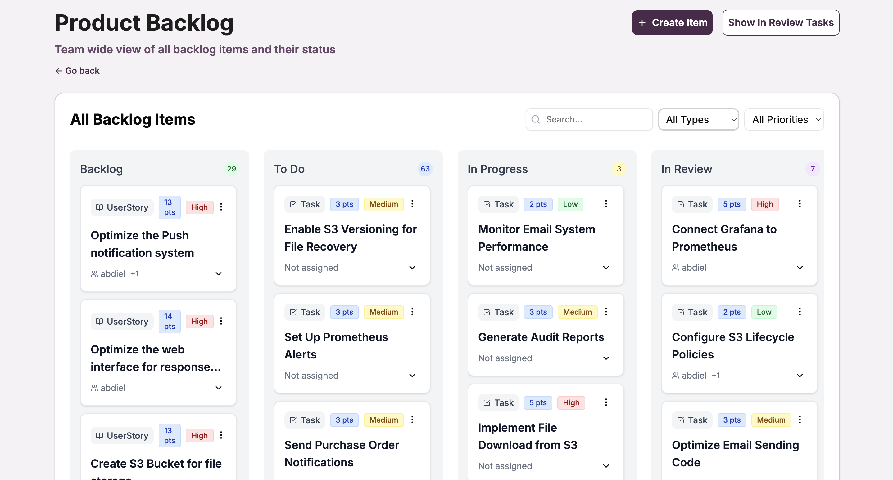
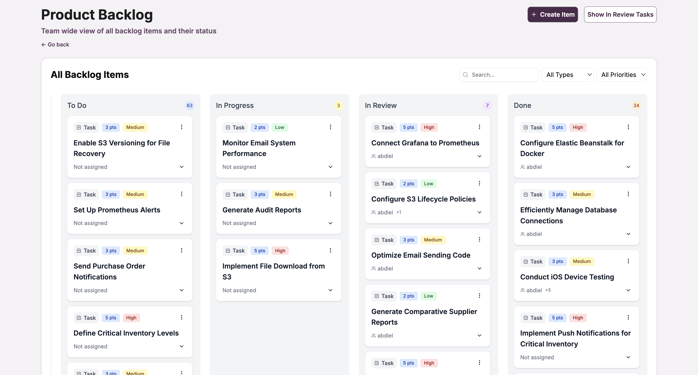

### Barra de búsqueda

Para facilitar la localización de elementos específicos en el backlog, utilice la barra de búsqueda disponible en la parte superior. Puede buscar por nombre, descripción o cualquier texto relevante de los elementos.

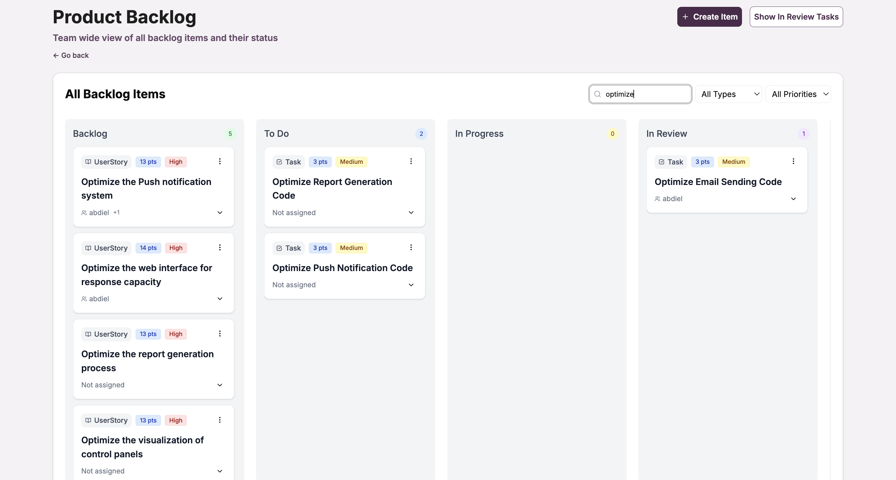

### Filtrado por tipos de elementos

El sistema permite filtrar los elementos del backlog por tipo para enfocarse en categorías específicas como **User Stories**, **Tasks** y  **Bugs**. Esto facilita la gestión y organización del trabajo.

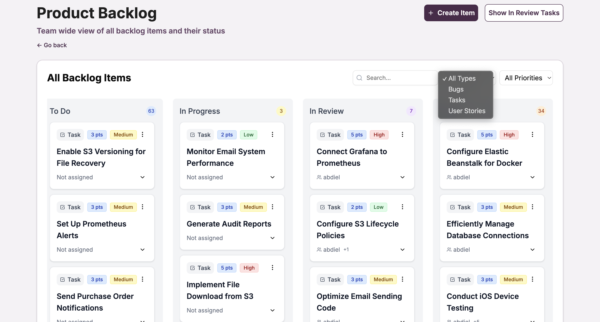

### Filtrado por prioridad

Puede filtrar los elementos del backlog según su nivel de prioridad para enfocarse en los elementos más críticos del proyecto. Las opciones incluyen prioridades como **High**, **Medium** y **Low**.

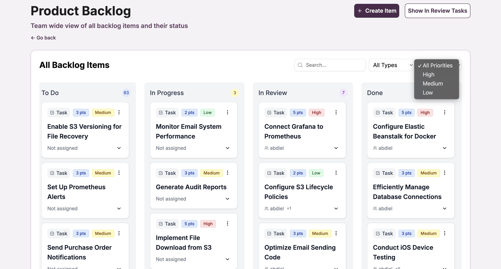

## Creación de elementos

### Creación de items

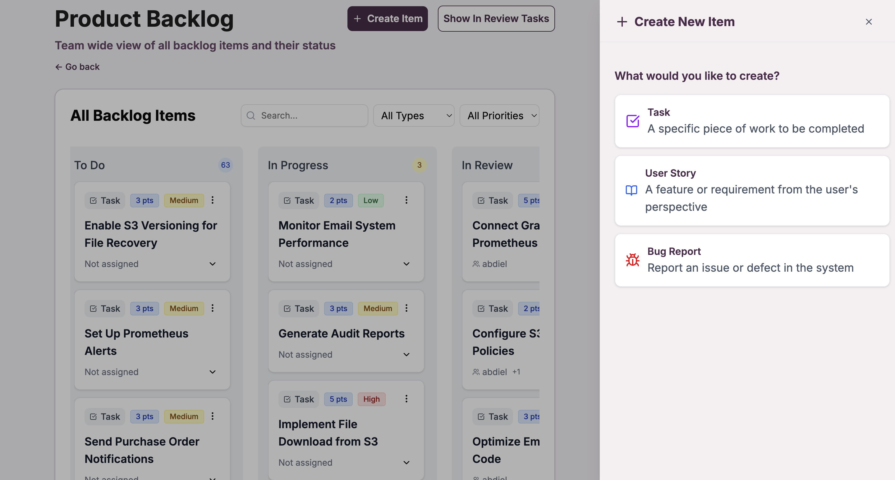

Se muestra la vista para la creación de items abarcando desde los Tasks, User Stories y Bugs, para todos los formularios los campos de título y descripción son obligatorios y los demás opcionales.

### Crear tareas (Tasks)

Para crear una nueva tarea en el proyecto, acceda a la opción de creación de **Tasks** desde el dashboard del backlog. Complete el formulario con los detalles técnicos, estimación y asignación correspondiente.

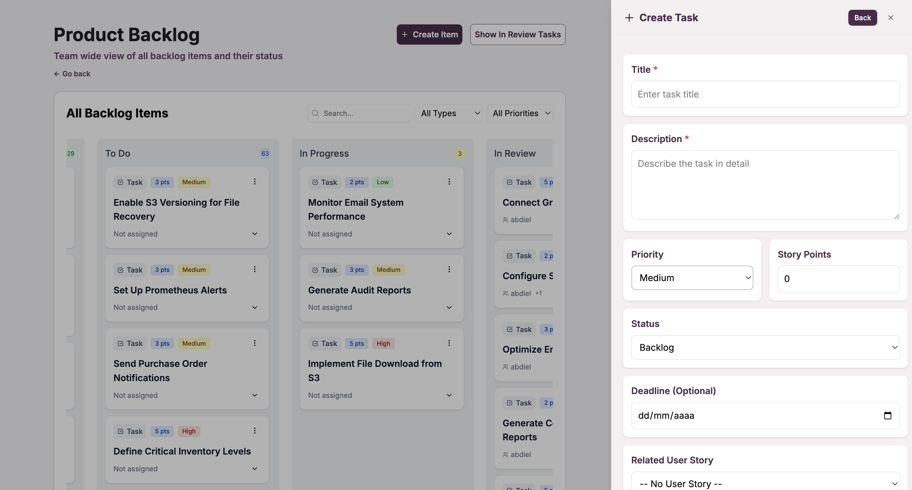
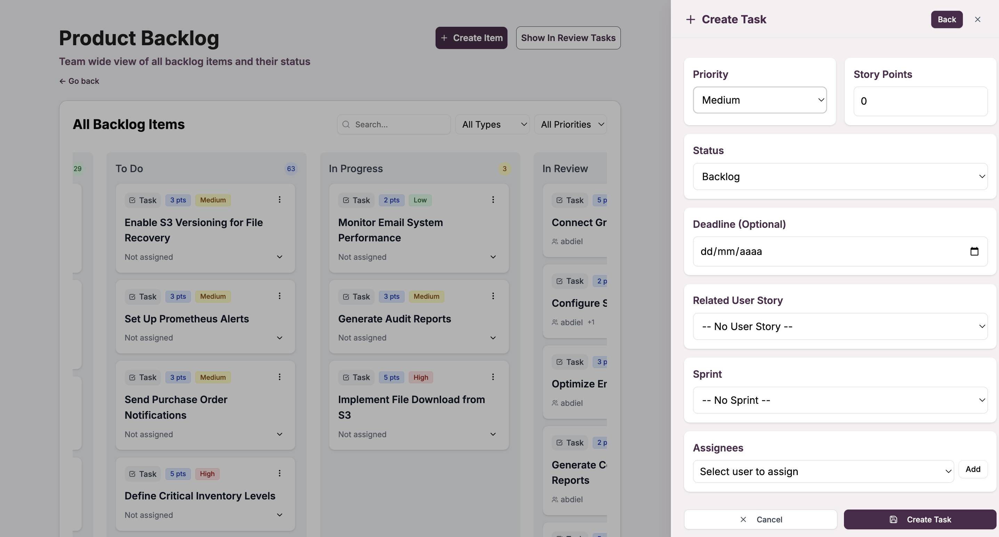

### Crear historias de usuario (User Stories)

El formulario de creación de **User Stories** permite definir funcionalidades desde la perspectiva del usuario final, incluyendo criterios de aceptación, estimación de puntos de historia y prioridad.

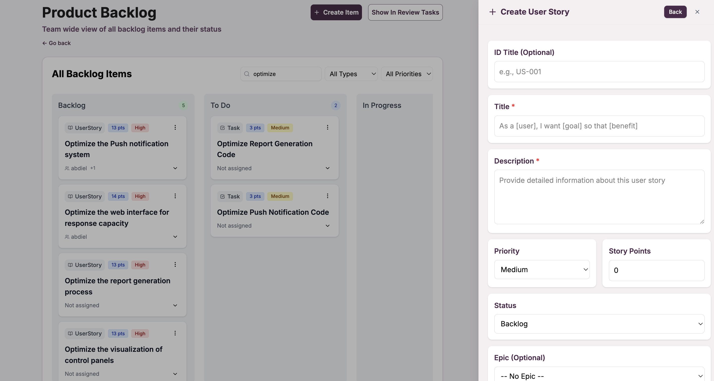
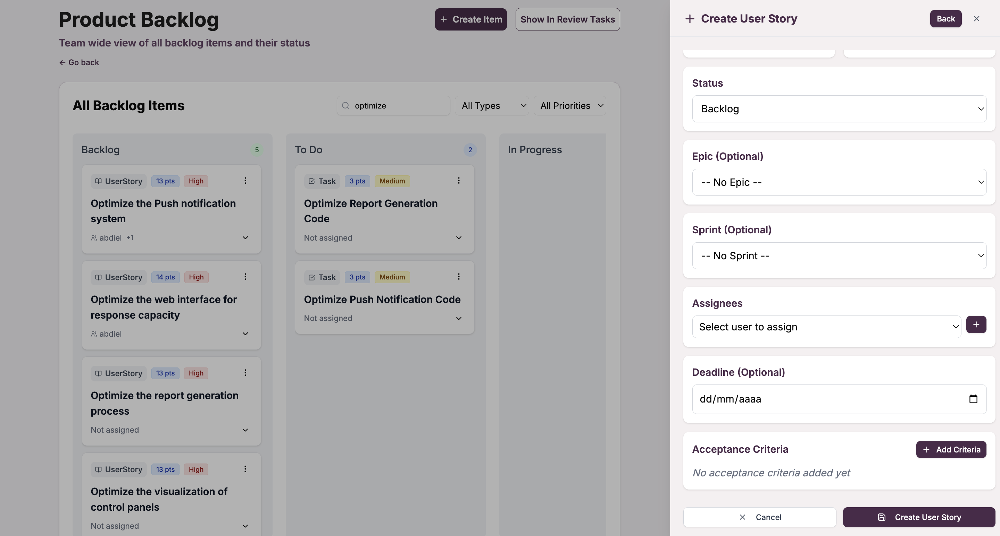

### Crear bugs (Bugs)

Para crear un nuevo bug en el proyecto, acceda a la sección de creación de **Bugs** desde el dashboard del backlog. Complete el formulario con los detalles del problema incluyendo descripción, steps para reproducir, severidad y asignación.

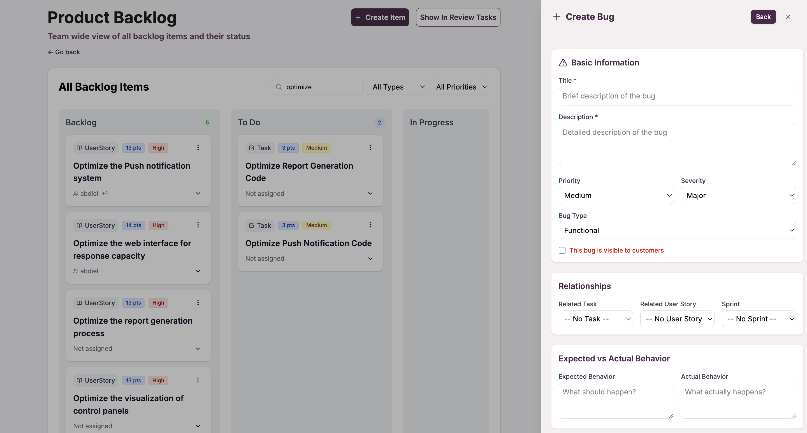
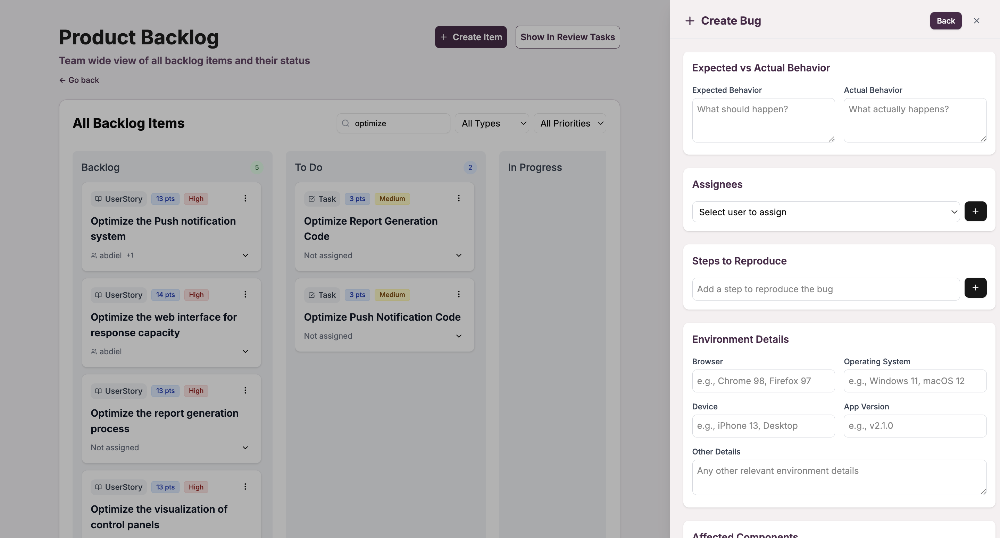
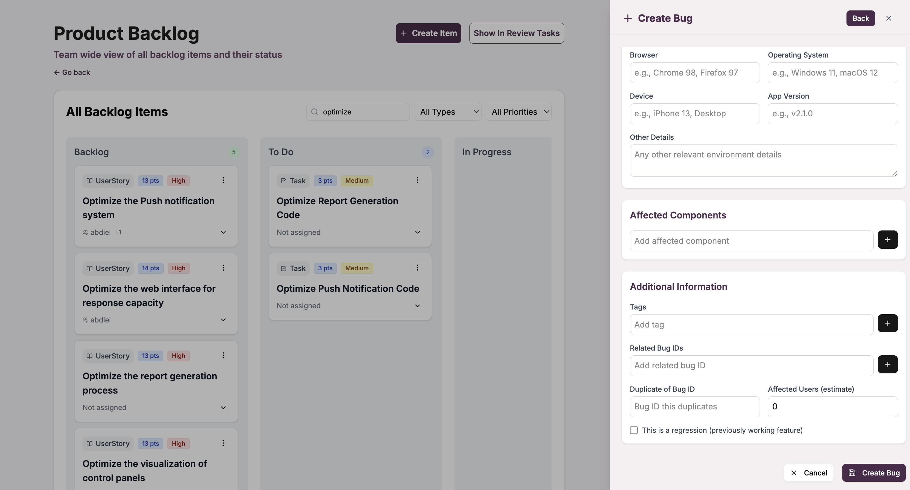

## Items Under Review

### Vista general 

El dashboard incluye una sección dedicada para visualizar todos los elementos que están actualmente bajo revisión. Esta vista permite un seguimiento eficiente del proceso de validación y aprobación de los diferentes elementos del proyecto.

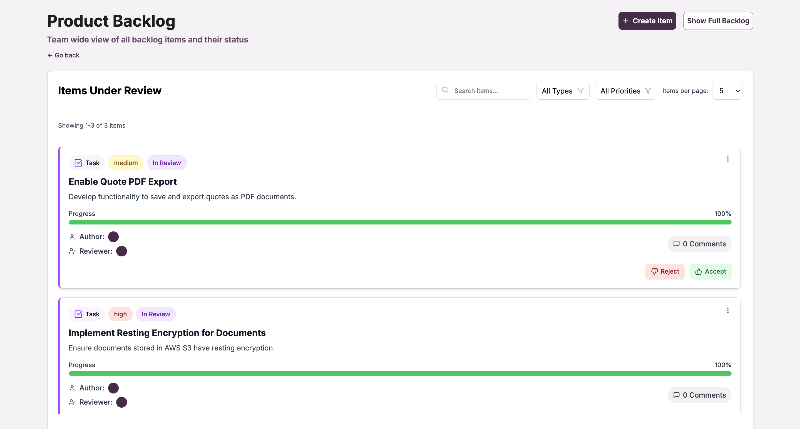

### Barra de búsqueda 

Para localizar elementos específicos en revisión, utilice la barra de búsqueda dedicada que permite encontrar rápidamente elementos por nombre, descripción o identificador.

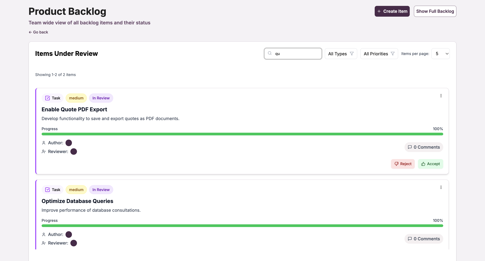

### Filtrado por tipos de elementos

Puede filtrar los elementos en revisión por tipo (**User Stories**, **Tasks**, **Bugs**, **Epics**) para enfocarse en categorías específicas durante el proceso de validación.

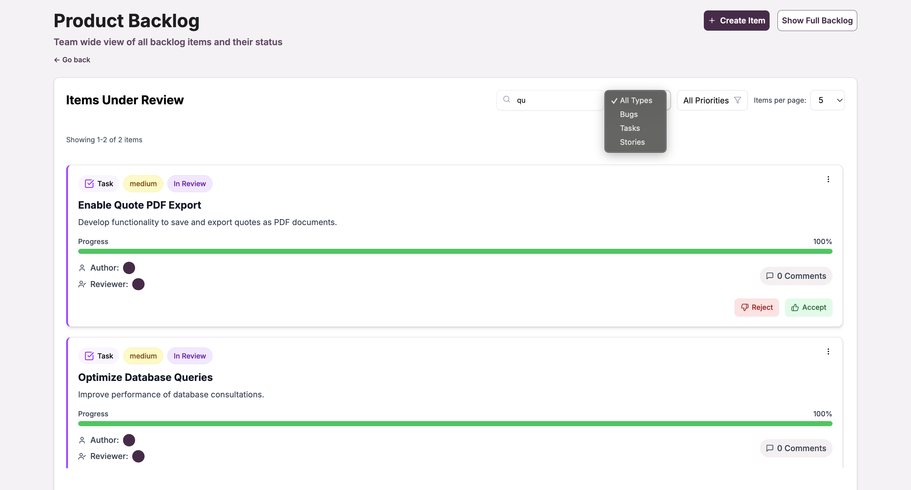

### Filtrado por prioridad 

El sistema permite filtrar los elementos en revisión según su nivel de prioridad, facilitando la gestión y priorización del proceso de validación según la criticidad de cada elemento.

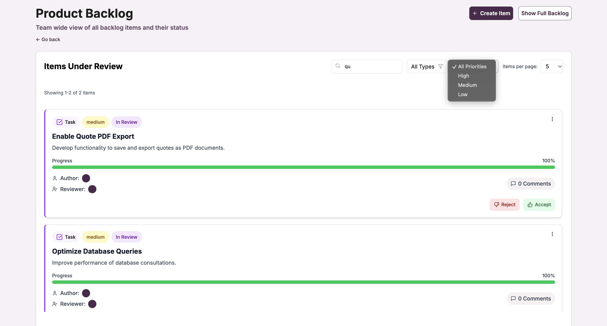

### Control de paginación

Para facilitar la gestión de grandes cantidades de elementos en revisión, el sistema incluye controles de paginación que permiten ajustar la cantidad de elementos mostrados por página y navegar eficientemente a través de todos los elementos.

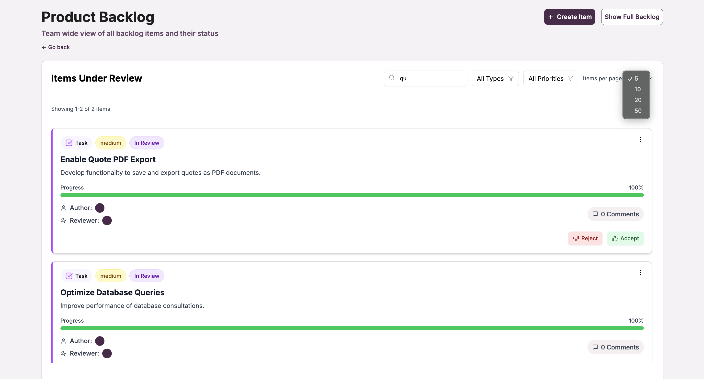

## Funcionalidades principales

### Gestión completa del backlog
- **Visualización organizada** de todos los elementos del proyecto
- **Búsqueda avanzada** por texto en nombres y descripciones
- **Filtrado múltiple** por tipo, prioridad y estado
- **Creación rápida** de nuevos elementos
- **Seguimiento detallado** del estado de revisión

### Tipos de elementos soportados
- **User Stories**: Historias de usuario con criterios de aceptación
- **Tasks**: Tareas técnicas y de desarrollo
- **Bugs**: Defectos y problemas encontrados

### Estados de seguimiento
- **Backlog**: Elementos pendientes de desarrollo (Solo historias de usuario)
- **To Do**: Elementos listos para el desarrollo 
- **In Progress**: Elementos actualmente en desarrollo
- **In Review**: Elementos en proceso de validación
- **Done**: Elementos completados y validados

### Herramientas de filtrado
- **Por tipo**: User Stories, Tasks, Bugs
- **Por prioridad**: High, Medium, Low
- **Por estado**: Backlog, To Do, In Progress, In Review, Done
- **Búsqueda textual**: Por nombre, descripción o contenido

:::info Gestión eficiente

El dashboard del backlog se actualiza automáticamente para reflejar los cambios más recientes en todos los elementos del proyecto, facilitando la toma de decisiones y la planificación del sprint.

:::

:::tip Mejores prácticas

- Utilice los filtros de prioridad para enfocar el trabajo del equipo en los elementos más importantes
- Revise regularmente la sección de "Items Under Review" para mantener un flujo de trabajo eficiente
- Use la búsqueda textual para localizar rápidamente elementos específicos
- Ajuste la paginación según sus preferencias de visualización

:::