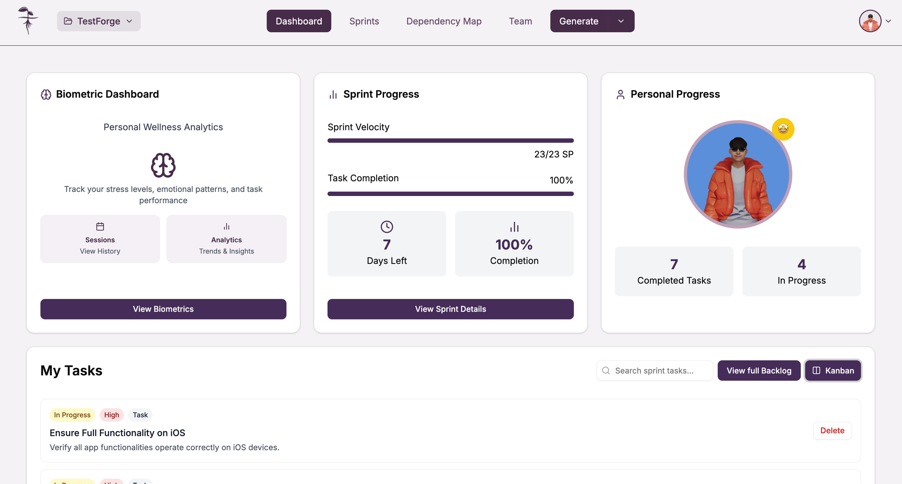
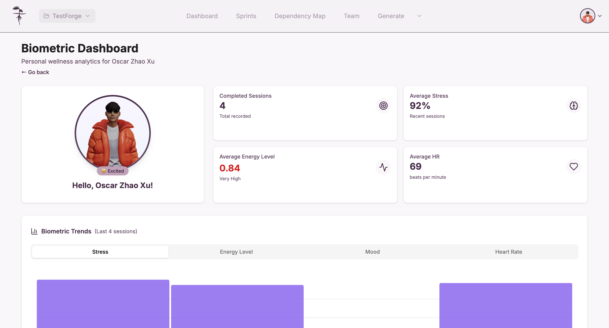
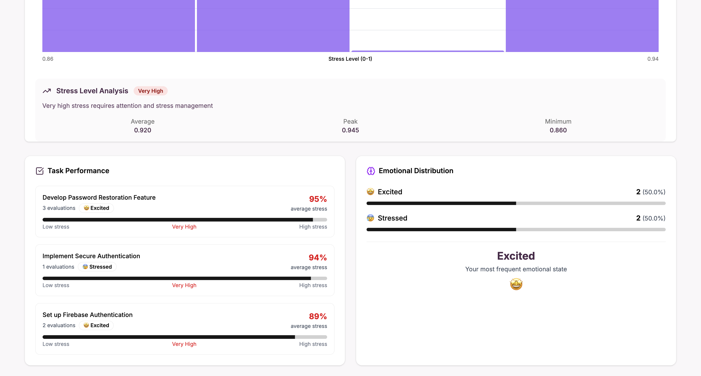

Cuando te encuentres en el dashboard principal de tu proyecto, además de visualizar el estado general del proyecto y tus tareas asignadas, también tendrás acceso a información sobre tus biométricos y bienestar personal.

## Acceso al panel de biométricos

En la sección principal del dashboard, encontrarás un recuadro titulado **Biometric Dashboard**. Este panel te permite monitorear tus niveles de estrés, patrones emocionales y desempeño en las tareas.

Para acceder a la información detallada, haz click en el botón **View Biometrics**.

## Analítica y sesiones de biométricos

Al ingresar al panel de biométricos, se muestra un resumen personalizado de tus métricas de bienestar, incluyendo:

- Número de sesiones completadas.
- Nivel promedio de estrés.
- Nivel promedio de energía.
- Frecuencia cardíaca promedio.

También puedes observar tendencias biométricas recientes, como el nivel de estrés a lo largo de las últimas sesiones, análisis detallado de estrés, desempeño en tareas y distribución emocional.

### Funcionalidades principales

- **Biometric Trends:** Visualiza la evolución de tus métricas (estrés, energía, ánimo y frecuencia cardíaca) en tus sesiones recientes.
- **Stress Level Analysis:** Obtén análisis detallados acerca de tus niveles de estrés y sugerencias para su manejo.
- **Task Performance:** Consulta el impacto emocional y de estrés en tareas específicas.
- **Emotional Distribution:** Observa la frecuencia de tus diferentes estados emocionales durante las sesiones.

:::info Nota

El dashboard de biométricos se actualiza automáticamente para reflejar los datos más recientes de tus sesiones y tareas.

:::