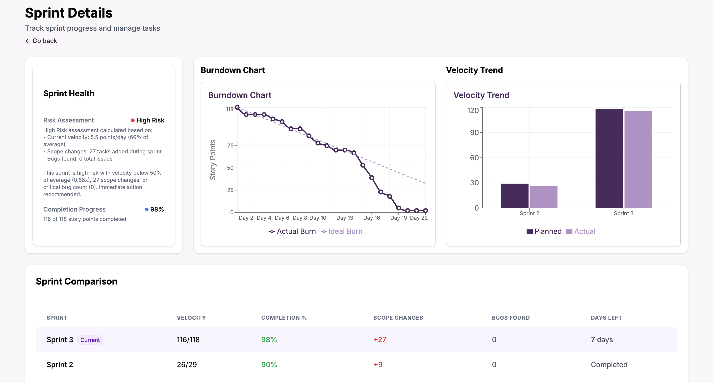

Para acceder a los detalles de un sprint, primero debe ingresar al dashboard principal de su proyecto. Desde esta vista, podrá ver información relevante sobre el progreso de sus tareas, sprints y métricas personales.

## Acceso al panel de detalles del sprint

En la sección principal del dashboard, encontrarás un recuadro titulado **Sprint Progress**. Este panel te permite ver información general del sprint actual como su velocidad, días restantes y porcentaje de completado, además de poder acceder a la información detallada.

Para acceder a la información detallada, haz click en el botón **View Sprint Details**.

## Visualización de detalles del sprint

Al ingresar a los detalles del sprint, se muestra un resumen completo del estado y progreso del sprint seleccionado, incluyendo:

- **Sprint Health:** Evaluación de riesgo del sprint, progreso de completitud y recomendaciones de acción.
- **Burndown Chart:** Gráfica del consumo de puntos de historia a lo largo del tiempo, comparando el avance real contra el ideal.
- **Velocity Trend:** Comparación de la velocidad planeada vs la velocidad real de los sprints recientes.
- **Sprint Comparison:** Tabla comparativa con métricas clave entre los diferentes sprints, como velocidad, porcentaje de completitud, cambios de alcance, bugs encontrados y días restantes.

:::info Importante

La vista de detalles del sprint se actualiza automáticamente para mostrar el avance más reciente y ayudar en la toma de decisiones durante la gestión del sprint.

:::