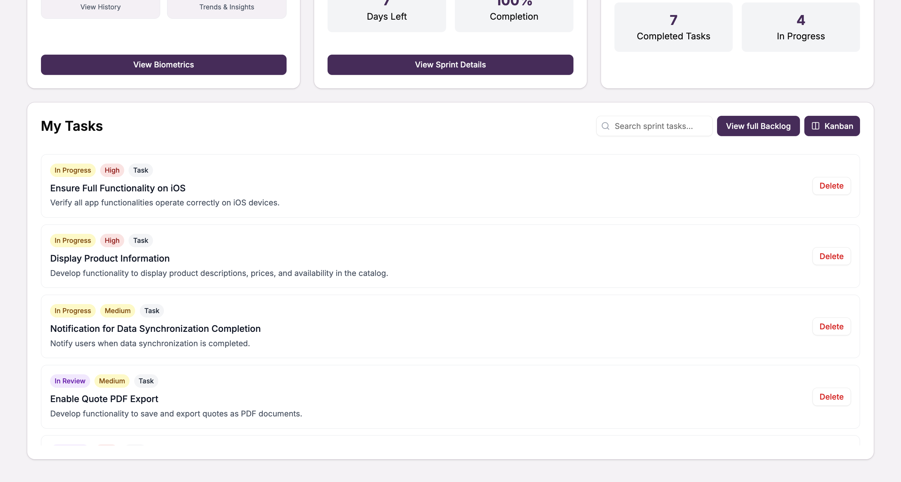

Para acceder al dashboard de un proyecto, primero debe seleccionar el proyecto deseado desde la vista principal de proyectos.

## Seleccionar un proyecto

En la vista de proyectos, seleccione el proyecto en el cual desea visualizar el **_dashboard_**; haga esto dando click sobre la tarjeta del proyecto en la pantalla "**_Projects_**"

## Visualización de dashboard

Después de la selección de un proyecto podrá instantáneamente ver el dashboard al ser siempre redirigido a este automáticamente al entrar a un proyecto. El dashboard le proporcionará una vista general del estado del proyecto incluyendo métricas importantes y accesos rápidos a las funcionalidades principales.

## Mis tareas

### Vista de listado

Podrá visualizar las tareas o bugs asignadas a su usuario en el apartado de "**_My Tasks_**" donde tendrá una vista de listado de sus respectivas tareas asignadas.

### Buscar tareas

También podrá buscar por nombre o descripción de la tarea o bug que desea encontrar utilizando la barra de búsqueda disponible en la sección.

### Vista Kanban

Tiene la opción de cambiar el formato de visualización de sus tareas; en lugar del listado puede cambiarlas a formato **Kanban** para una mejor organización visual del flujo de trabajo.

:::info Importante

El dashboard se actualiza automáticamente para reflejar los cambios más recientes en el proyecto y sus tareas asignadas.

:::