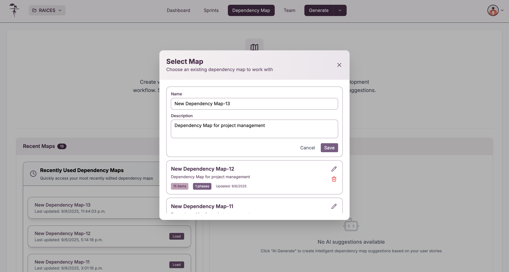

Para gestionar los mapas de dependencias del proyecto, debe acceder a la sección **"Dependency Map"** desde el menú principal donde podrá crear, cargar, editar, eliminar y generar mapas usando inteligencia artificial.

## Acceso a la gestión de mapas

Navegue a la sección **"Dependency Map"** desde el menú principal del proyecto para acceder a todas las funcionalidades de gestión de mapas de dependencias.

## Vista principal

### Información general

La vista principal del mapa de dependencias presenta:
- **Título de la sección**: "Dependency Map"
- **Descripción del propósito**: Crear mapas visuales para entender las relaciones del proyecto y planificar el flujo de desarrollo
- **Opciones de trabajo**: Crear nuevo mapa, cargar existente o generar con IA

### Opciones principales

En la parte superior se encuentran tres botones principales:
- **Create New Map**: Para crear un mapa de dependencias desde cero
- **Load Existing**: Para cargar mapas previamente creados
- **AI Generate**: Para generar mapas automáticamente usando inteligencia artificial

### Secciones disponibles

La interfaz se divide en dos áreas principales:
- **Recent Maps**: Lista de mapas utilizados recientemente con acceso rápido
- **AI-Generated Suggestions**: Sugerencias de mapas generados por inteligencia artificial

## Crear nuevo mapa

### Proceso de creación

Para crear un nuevo mapa de dependencias:
1. Haga clic en **"Create New Map"** desde la vista principal
2. Complete el formulario con el nombre del mapa
3. Agregue una descripción opcional del propósito del mapa
4. Confirme la creación haciendo clic en **"Create Roadmap"**

### Campos del formulario

El formulario de creación incluye:
- **Map Name**: Nombre identificativo del mapa (obligatorio)
- **Description**: Descripción opcional del propósito y contexto del mapa
- **Botones de acción**: "Cancel" para cancelar o "Create Roadmap" para confirmar

## Cargar mapas existentes

### Selección de mapas

Al hacer clic en **"Load Existing"**, se abre una ventana modal que muestra todos los mapas disponibles del proyecto.

### Lista de mapas disponibles

La ventana de selección muestra:
- **Nombre del mapa**: Identificación de cada mapa disponible
- **Descripción**: Propósito de cada mapa de dependencias
- **Métricas**: Número de elementos y fases incluidos
- **Fecha de actualización**: Última modificación realizada
- **Acciones**: Opciones para editar o eliminar cada mapa

### Gestión individual

Para cada mapa en la lista puede:
- **Seleccionar**: Hacer clic para abrir y trabajar con el mapa
- **Editar**: Usar el ícono de lápiz para modificar nombre y descripción
- **Eliminar**: Usar el ícono de papelera para borrar el mapa

## Editar mapas existentes

### Modificación de información

Para editar un mapa existente, haga clic en el ícono de edición (lápiz) en la lista de mapas disponibles.

### Campos editables

En el formulario de edición puede modificar:
- **Name**: Cambiar el nombre del mapa de dependencias
- **Description**: Actualizar la descripción y propósito del mapa
- **Guardar cambios**: Usar el botón "Save" para confirmar las modificaciones
- **Cancelar**: Usar "Cancel" para descartar los cambios

## Eliminar mapas

### Proceso de eliminación

Para eliminar un mapa de dependencias:
1. Haga clic en el ícono de papelera en la lista de mapas
2. Confirme la eliminación en el diálogo de confirmación
3. El mapa será removido permanentemente del proyecto

### Confirmación de eliminación

El sistema muestra un diálogo de confirmación que incluye:
- **Título**: "Delete Roadmap"
- **Mensaje de confirmación**: Verificación del mapa a eliminar
- **Advertencia**: "This action cannot be undone"
- **Opciones**: "Cancel" para cancelar o "Delete" para confirmar la eliminación

## Generación con inteligencia artificial

### Sugerencias automáticas

El sistema puede generar mapas de dependencias automáticamente basándose en las historias de usuario y tareas del proyecto.

### Selección de fases

La generación con IA permite:
- **Seleccionar fases**: Elegir las fases del proyecto a incluir en el mapa
- **Revisar sugerencias**: Ver las propuestas generadas automáticamente
- **Personalizar selección**: Marcar o desmarcar fases específicas
- **Crear mapa**: Generar el mapa final con las fases seleccionadas

### Configuración de generación

En el panel de sugerencias puede:
- **Seleccionar/Deseleccionar fases**: Usar los checkboxes para incluir fases específicas
- **Ver detalles**: Expandir cada fase para ver las historias de usuario incluidas
- **Crear mapa**: Usar "Create Dependency Map" para generar el mapa final
- **Limpiar sugerencias**: Usar "Clear Suggestions" para reiniciar la selección

## Características de los mapas

### Elementos soportados

Los mapas de dependencias trabajan exclusivamente con:
- **Historias de usuario**: User stories del proyecto
- **Tareas**: Tasks técnicas y de desarrollo

### Funcionalidades principales

- **Gestión completa**: Crear, cargar, editar y eliminar mapas
- **Generación automática**: Uso de IA para crear mapas basados en el proyecto
- **Organización por fases**: Agrupación lógica de elementos relacionados
- **Acceso rápido**: Lista de mapas recientes para acceso directo
- **Validación**: Confirmación antes de acciones destructivas

:::info Elementos compatibles

Los mapas de dependencias solo incluyen historias de usuario y tareas del proyecto. Los bugs y épicas no son considerados para la creación de dependencias.

:::

:::tip Organización eficiente

Use nombres descriptivos para sus mapas de dependencias y mantenga actualizadas las descripciones para facilitar la identificación del propósito de cada mapa.

:::