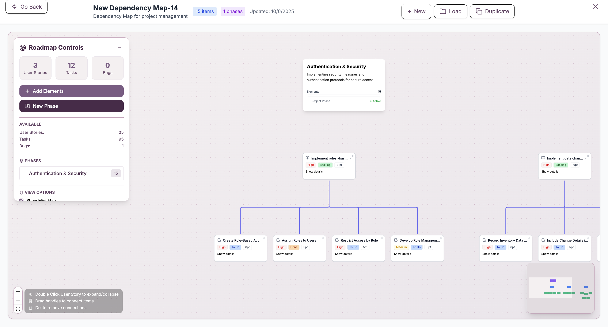
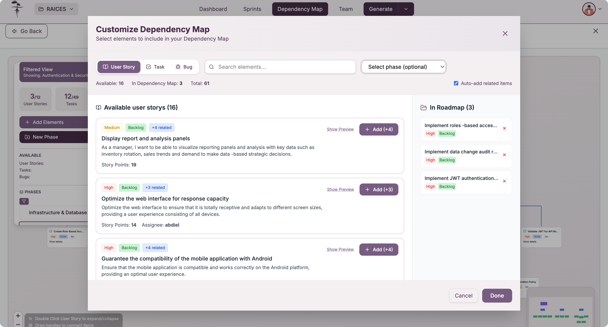
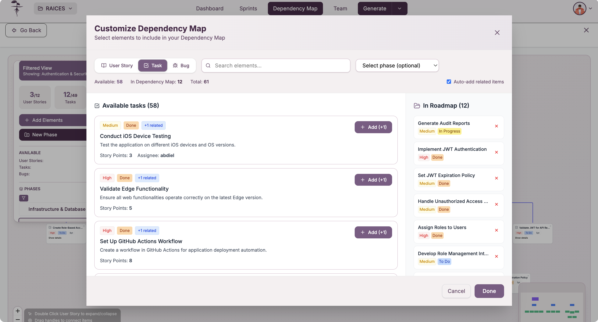
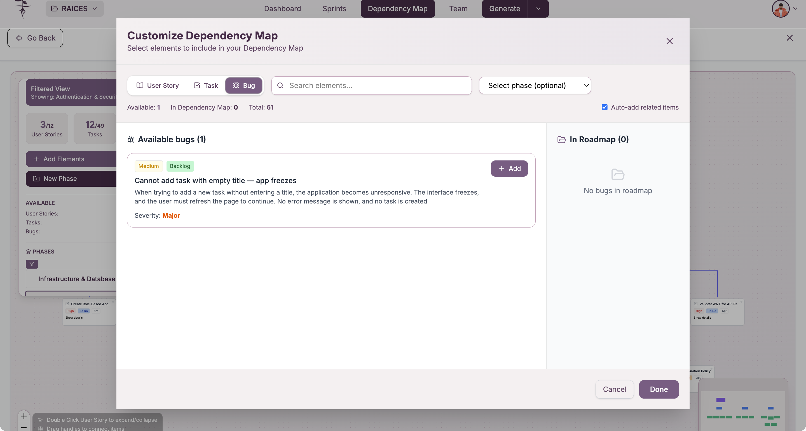
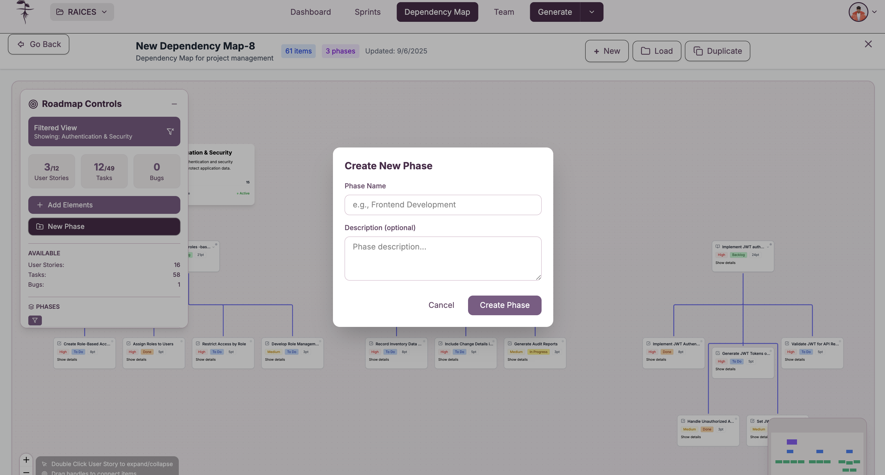
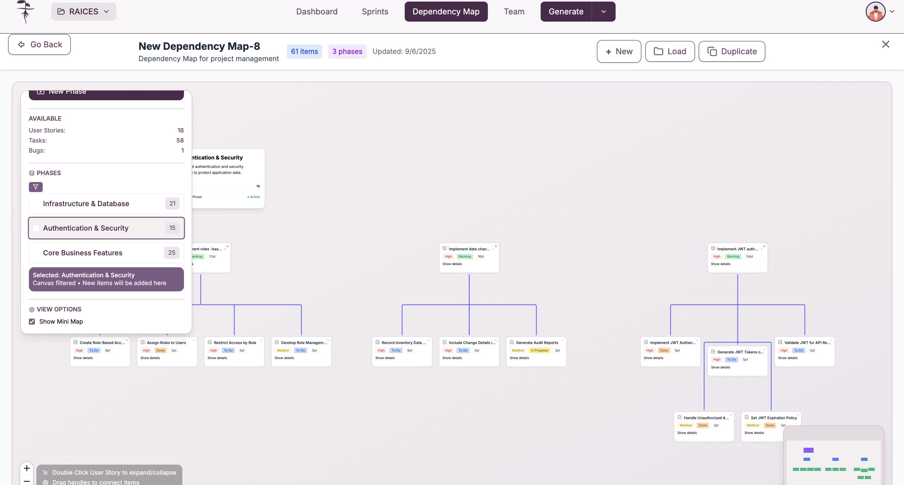

Una vez creado o cargado un mapa de dependencias, puede visualizar y trabajar con las relaciones entre historias de usuario, tareas y bugs organizados por fases del proyecto.

## Acceso a la visualización

Después de crear un nuevo mapa o cargar uno existente desde la gestión de mapas de dependencias, accederá automáticamente a la vista de visualización donde puede trabajar con las dependencias y fases del proyecto.

## Vista detallada del mapa

### Mapa completo de dependencias

La vista principal muestra todos los elementos de todas las fases del mapa en un formato visual interactivo, permitiendo visualizar y gestionar las relaciones entre elementos.

La visualización incluye:
- **Elementos por fases**: Historias de usuario, tareas y bugs organizados en secciones
- **Líneas de conexión**: Vínculos que muestran las dependencias entre elementos
- **Controles de navegación**: Herramientas para agregar elementos y gestionar fases
- **Área de trabajo**: Canvas interactivo para crear y modificar dependencias

### Organización por fases

El mapa se organiza en fases que representan:
- **Secciones del proyecto**: Agrupaciones lógicas de elementos relacionados
- **Subconjuntos de elementos**: Cada fase contiene una parte específica de historias de usuario y tareas
- **Flujo secuencial**: Las fases pueden representar etapas temporales del desarrollo
- **Agrupación funcional**: Elementos relacionados por funcionalidad o propósito

## Agregar elementos al mapa

### Agregar historias de usuario

Para incluir nuevas historias de usuario en el mapa, utilice la opción correspondiente que permite seleccionar de las user stories disponibles en el proyecto.

### Agregar tareas

Puede agregar tareas específicas al mapa seleccionando de la lista de tasks disponibles en el proyecto.

### Agregar bugs

También es posible incluir bugs en el mapa de dependencias para considerar las correcciones necesarias en el flujo de desarrollo.

### Proceso de selección

Para agregar cualquier tipo de elemento:
1. **Seleccione el tipo**: User Stories, Tasks o Bugs
2. **Marque los elementos**: Use los checkboxes para seleccionar elementos específicos
3. **Confirme la adición**: Los elementos se agregarán al mapa actual
4. **Ubique en fases**: Asigne los elementos a las fases correspondientes

## Gestión de fases

### Crear nuevas fases

Puede crear nuevas fases para organizar mejor los elementos del mapa según las necesidades del proyecto.

El proceso de creación incluye:
- **Nombre de la fase**: Identificación clara de la sección
- **Descripción**: Propósito y contexto de la fase
- **Ubicación**: Posición relativa en el flujo del proyecto
- **Asignación de elementos**: Qué historias de usuario y tareas pertenecen a esta fase

### Filtrado por fases

Use los controles de filtrado para visualizar fases específicas del mapa, permitiendo enfocarse en secciones particulares del proyecto.

Las opciones de filtrado permiten:
- **Seleccionar fases específicas**: Mostrar solo las fases de interés
- **Ocultar fases**: Simplificar la vista removiendo secciones no relevantes
- **Vista completa**: Mostrar todas las fases y elementos del mapa
- **Navegación rápida**: Saltar entre diferentes secciones del proyecto

## Tipos de conexiones permitidas

### Dependencias entre elementos

El sistema permite crear dependencias entre diferentes tipos de elementos:

#### Historias de usuario ↔ Tareas
- **US → Task**: Una historia de usuario requiere tareas específicas
- **Task → US**: Una tarea es prerequisito para una historia de usuario

#### Historias de usuario ↔ Bugs
- **US → Bug**: Una historia de usuario depende de la corrección de un bug
- **Bug → US**: Un bug debe resolverse antes de implementar una historia

#### Historias de usuario ↔ Historias de usuario
- **US → US**: Una historia de usuario es prerequisito de otra
- **US ↔ US**: Dependencias bidireccionales entre historias relacionadas

### Creación de dependencias

Para establecer una dependencia:
1. **Seleccione el elemento origen**: Haga clic en el elemento inicial
2. **Arrastre hacia el destino**: Conecte con el elemento dependiente
3. **Confirme la relación**: La línea de dependencia se creará automáticamente
4. **Verifique la dirección**: Asegúrese de que la dependencia sea correcta

## Navegación y controles

### Herramientas de vista

La interfaz incluye controles para:
- **Zoom**: Acercar o alejar para ver detalles o vista general
- **Panorámica**: Mover la vista por diferentes áreas del mapa
- **Centrado automático**: Ajustar la vista para mostrar todos los elementos
- **Navegación por fases**: Saltar rápidamente entre diferentes secciones

### Organización visual

Puede mejorar la visualización mediante:
- **Reordenamiento de elementos**: Arrastrar elementos para mejor organización
- **Agrupación por fases**: Mantener elementos relacionados juntos
- **Optimización de conexiones**: Minimizar cruces de líneas de dependencia
- **Distribución equilibrada**: Usar el espacio disponible eficientemente

## Análisis del mapa

### Identificación de patrones

El mapa permite identificar:
- **Secuencias críticas**: Cadenas de dependencias que determinan tiempos
- **Elementos centrales**: Historias o tareas con múltiples conexiones
- **Puntos de bloqueo**: Elementos que pueden retrasar múltiples items
- **Fases independientes**: Secciones que pueden desarrollarse en paralelo

### Validación de dependencias

Verifique que las dependencias establecidas:
- **Sean lógicamente consistentes**: Las relaciones tengan sentido funcional
- **No creen ciclos**: Evitar dependencias circulares que causen bloqueos
- **Reflejen la realidad**: Correspondan al flujo real de desarrollo
- **Sean necesarias**: No incluir dependencias innecesarias que compliquen el proyecto

:::info Elementos y dependencias

Los mapas de dependencias incluyen historias de usuario, tareas y bugs, y permiten crear relaciones entre cualquier combinación de estos elementos, incluyendo dependencias entre historias de usuario.

:::

:::tip Organización eficiente

Use las fases para organizar elementos por funcionalidad, tiempo o responsabilidad, y aproveche los filtros para trabajar con secciones específicas del proyecto sin perder la vista del contexto general.

:::
