Para acceder a la generación de épicas, de click en la opción "**_Generate Epics_**" dentro de la vista "**_Generate_**"
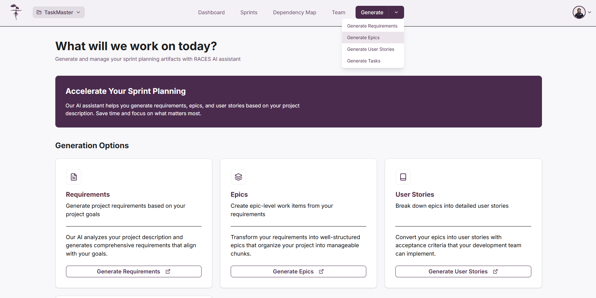 

Alternativamente, si ya está dentro de la pantalla de requerimientos puede dar click sobre el botón "**_Epics_**" en la cintilla de opciones.
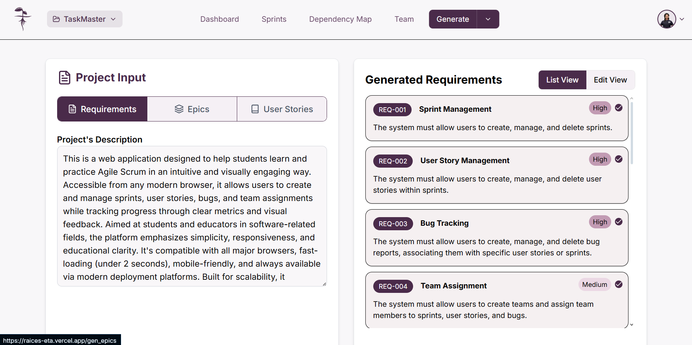

Una vez seleccionado, llegará a la vista de "**_Generate Epics_**". Aquí usted dispondrá de los requerimientos seleccionados previamente que servirán como base para generar las épicas mediante inteligencia artificial.
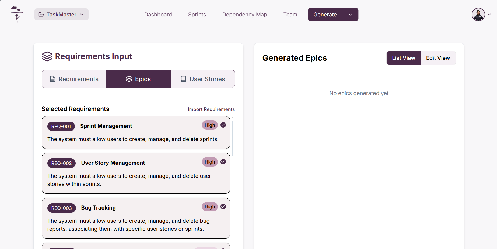

:::info

Si desea cambiar los requerimientos selccionados, necesita repetir el [proceso de selección de requerimientos en la pantalla de generación de requerimientos](Requirements/#seleccionar-requerimientos)

:::

## Importar requerimientos

Si no cuenta con requerimientos seleccionados, puede importar todos los requerimientos guardados en la base de datos dando click en el botón "**_Import Requirements_**". Esto abrirá una ventana emergente para confirmar la importación de todos los requerimientos disponibles para el proyecto, de click en "**_Import_**" para confirmar.

Botón "**_Import Requirements_**"
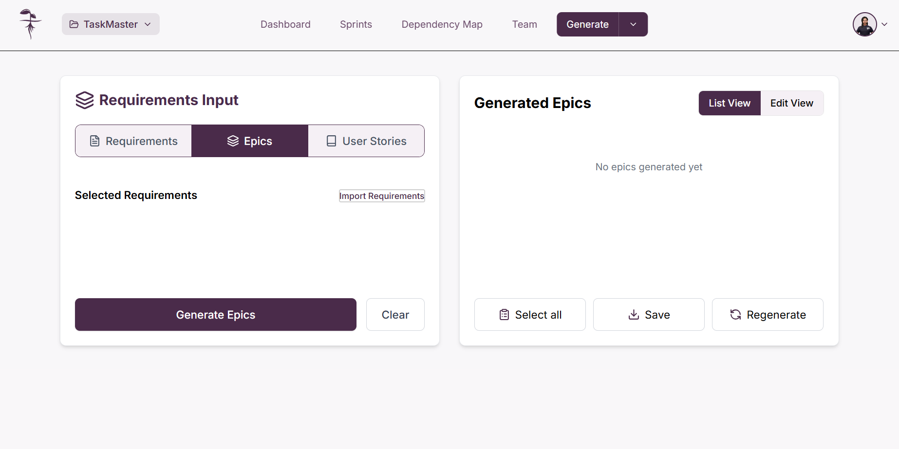

Confirmación para importar requerimientos
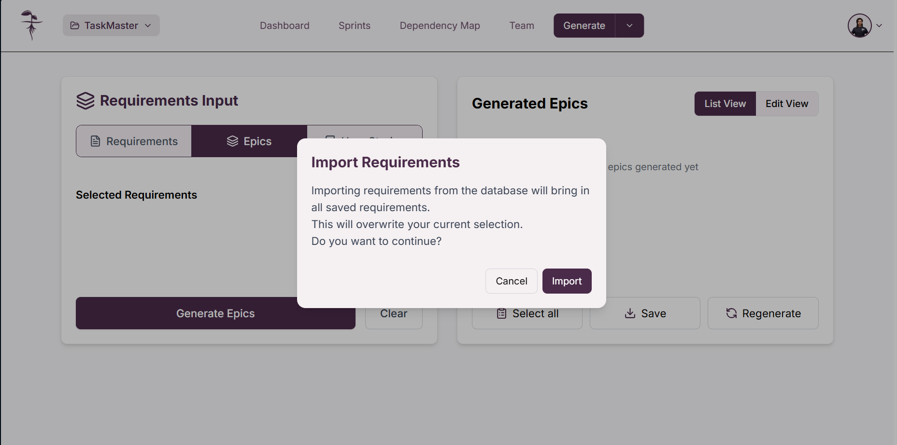

## Generar épicas

### Generar épicas con inteligencia artificial

Para generar épicas usando la inteligencia artificial, asegúrese de tener **requerimientos seleccionados** ya que estos servirán como entrada para el proceso de generación. Una vez tenga los requerimientos necesarios, de click en "**_Generate Epics_**"
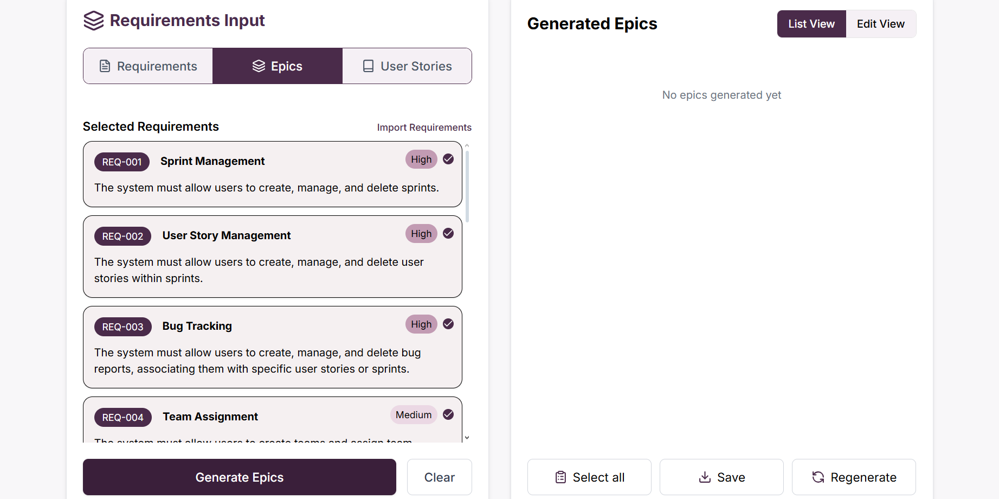

Tras esto se abrirá una ventana emergente pidiendo la confirmación ya que generar nuevas épicas sobreescribirá las que ya se tenían hechas, de click en "**_Generate_**" para confirmar la generación. A continuación tendrá que esperar mientras la inteligencia artificial procesa y genera las épicas
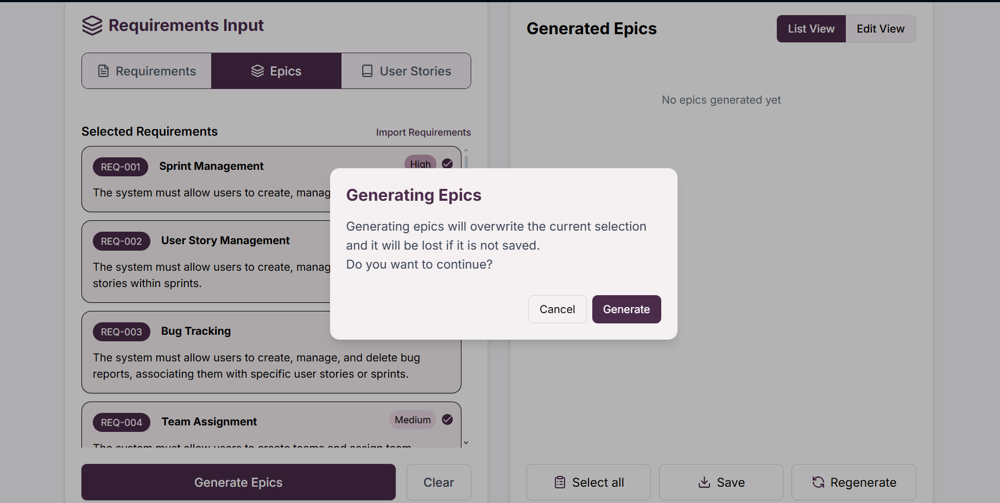

Una vez concluido el proceso podrá ver las épicas generadas en base a los requerimientos seleccionados. En la lista generada usted podrá **[seleccionar las épicas](#seleccionar-épicas)** con las que esté conforme o editar las épicas para ajustarlas.
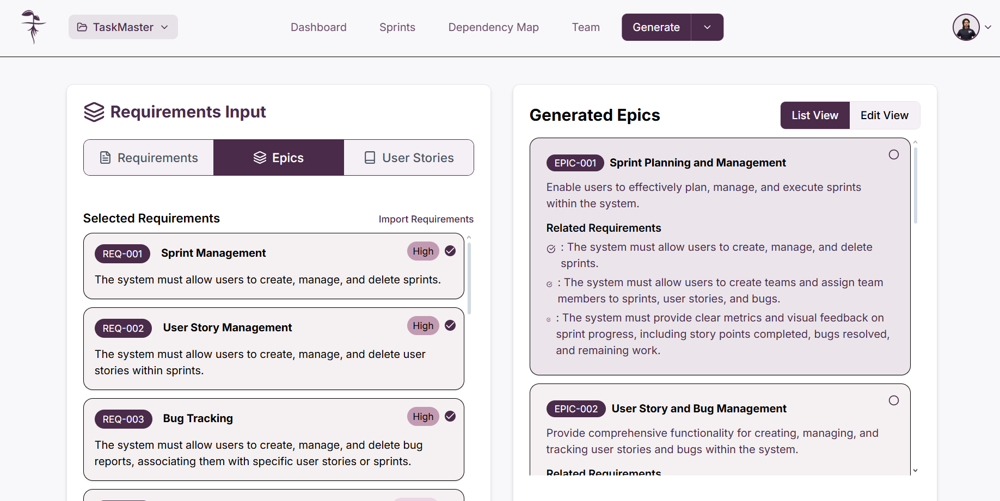

#### Volver a generar épicas con inteligencia artificial

Puede volver a generar las épicas generadas por la inteligencia artificial para obtener épicas diferentes si siente que las generadas no cumplen con lo que busca. Para esto de click en el botón "**_Regenerate_**". Esto abrirá una ventana emergente para que confirme si usted desea proceder, de click en "**_Generate_**" para volverlas a generar.

Botón "**_Regenerate_**"
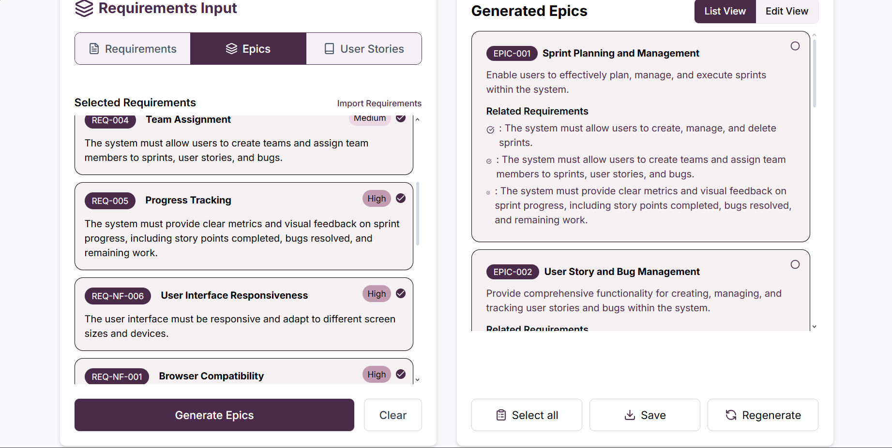

Mensaje de confirmación
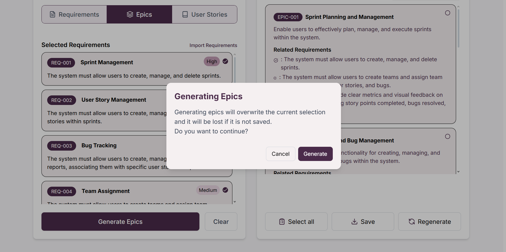

:::warning Cuidado

Volver a generar las épicas hará que se sobreescriba la lista presentada actualmente y no podrá recuperarlas

:::

### Agregar épicas manualmente

Puede agregar épicas del proyecto de manera manual, para esto de click en "**_Edit View_**" y después en "**_+ Add Manually_**"; esto abrirá un formulario para añadir los detalles de la épica. Una vez haya terminado de agregar los detalles de click en "**_Add_**".

Vista de edición y opción de añadir épica
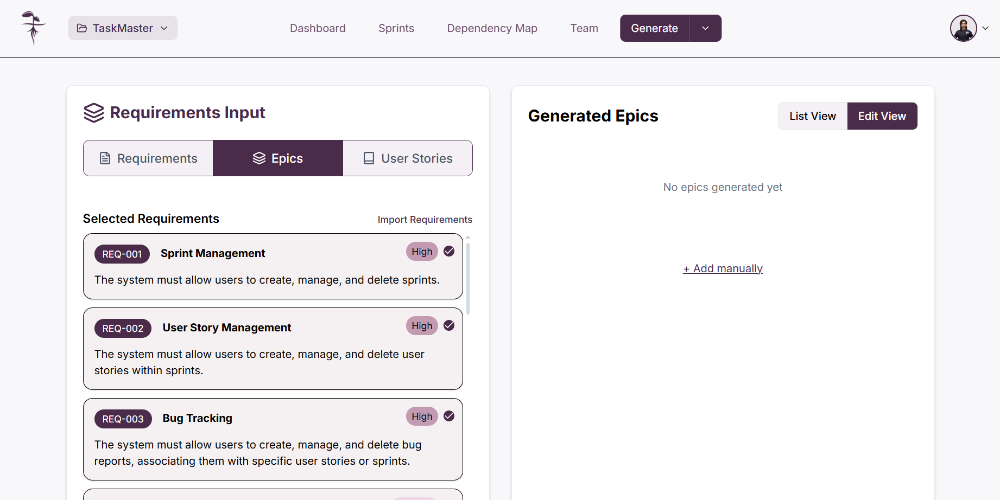

Vista del formulario para añadir épica

## Editar épicas

Puede editar las épicas creadas desde la vista de edición. Para esto será necesario que de click en "**_Edit View_**", después de esto de click sobre el ícono de lápiz para abrir el formulario de edición donde podrá añadir a cuáles requerimientos esta asociado; una vez haya terminado de editar la información de la épica de click en "**_Save_**"

Vista de edición de épicas:
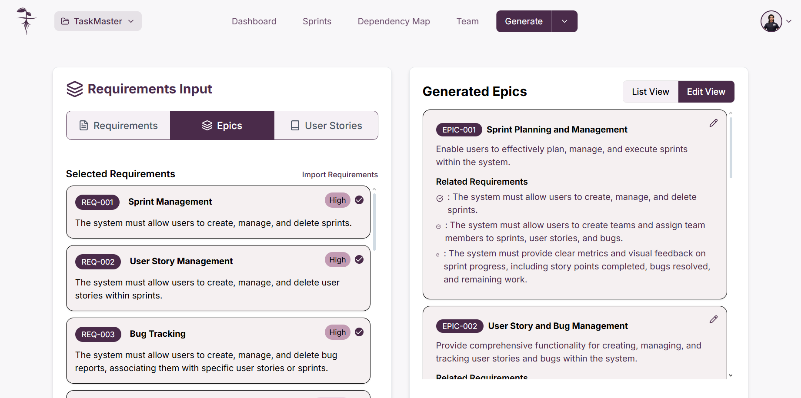

Formulario de edición y botón "**_Save_**"
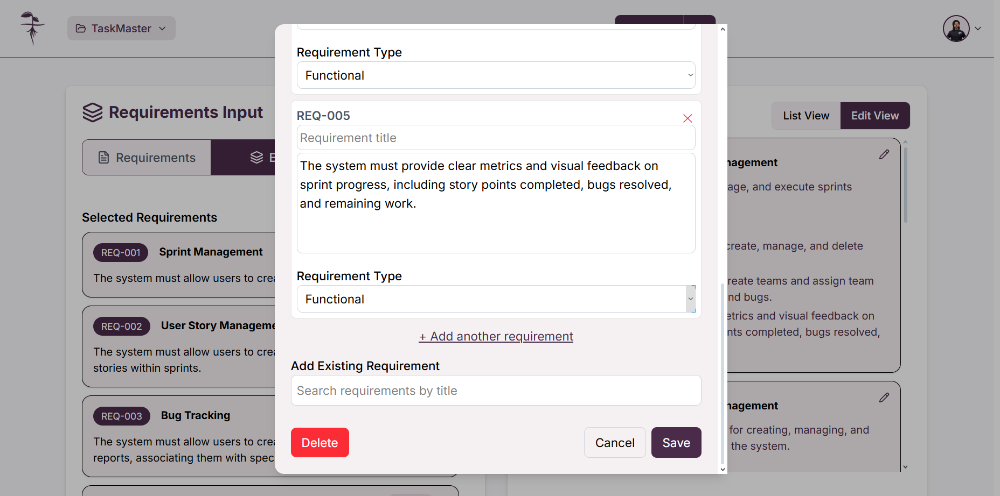

## Eliminar épicas

Puede eliminar épicas desde la vista de edición. Haga click en "**_Edit View_**" y de click sobre el ícono de lápiz para abrir el formulario de edición, una vez ahí de click en "**_Delete_**" para eliminar la épica deseada.

Vista de edición de épicas:

Formulario de edición y botón "**_Delete_**"

:::warning Cuidado

Al eliminar una épica no es posible recuperarla

:::

## Seleccionar épicas

Cuando tenga épicas agregadas, selecciónelas dando click sobre ellas o puede decidir seleccionar todas haciendo click en el botón "**_Select all_**".

Para deshacer la selección de épicas de click sobre la épica a eliminar de la selección.

Selección de épicas

Botón "**_Select All_**"
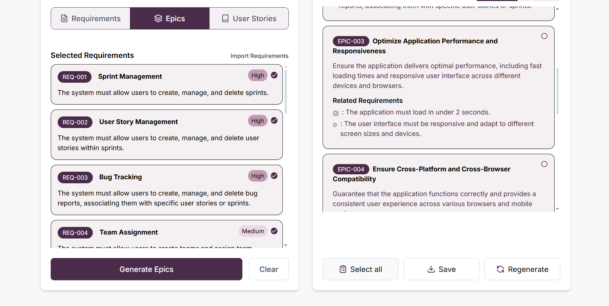 

## Guardar épicas

Cuando esté conforme con su selección de épicas generadas, guárdelas dando click en el botón "**_Save_**"; esto abrirá una ventana emergente preguntando por confirmación, de click en "**_Save_**". Asegúrese que todas las épicas que desea conservar estén seleccionadas correctamente.

Botón "**_Save_**"
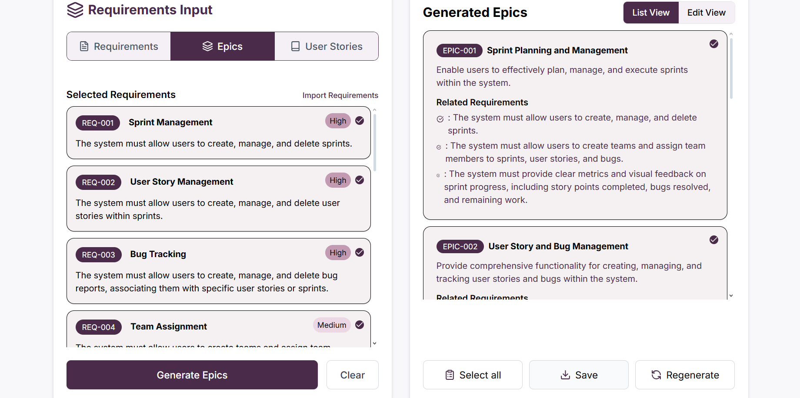

Mensaje de confirmación para guardar épicas
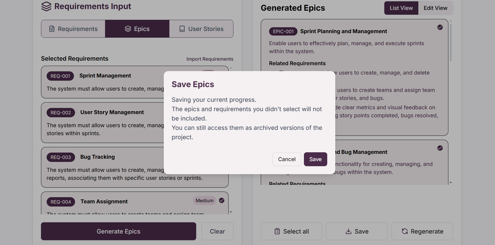

Mensaje de éxito 

:::info Importante

Recuerde que solo se guardarán las épicas seleccionadas

:::

## Eliminar todas las épicas y requerimientos

Puede usar el botón "**_Clear_**" para eliminar todas las épicas y requerimientos, independientemente de si están seleccionados o no. Al dar click en el botón "**_Clear_**" se le mostrará una ventana emergente para confirmar la eliminación de todas las épicas y requerimientos, de click en "**_Confirm_**" para eliminar todo el contenido.

Botón "**_Clear_**"
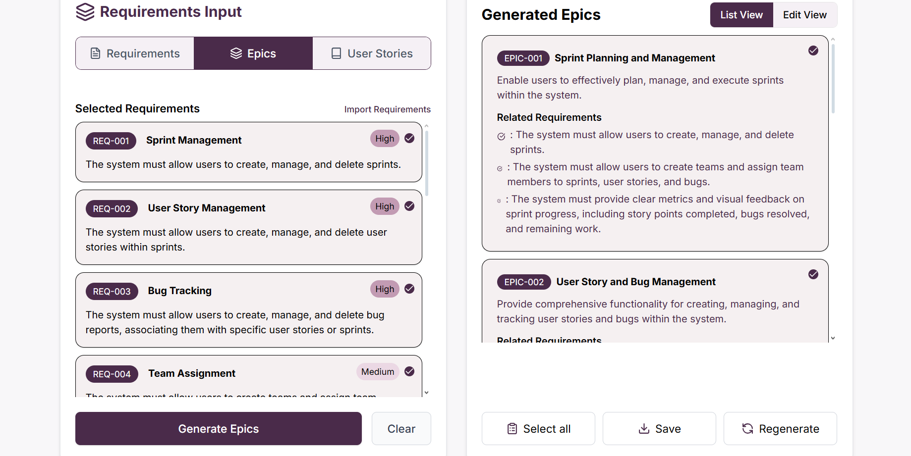

Vista confirmación de eliminación de todas las épicas y requerimientos
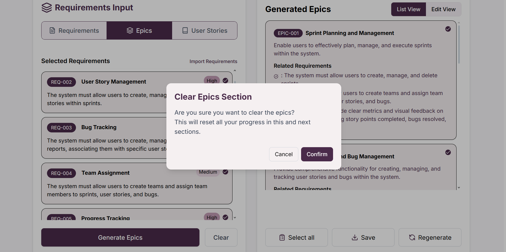

:::warning Cuidado

Eliminar todas las épicas y requerimientos es un proceso no reversible y toda la información no guardada se perderá. Puede guardar las épicas y requerimientos si desea conservarlos.

:::