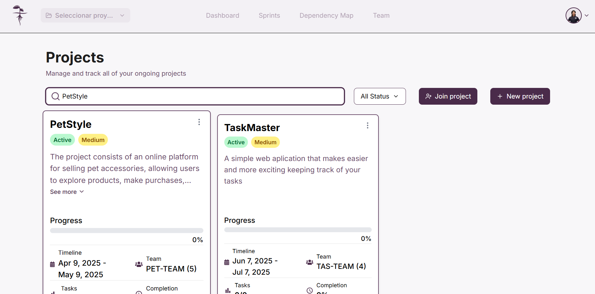
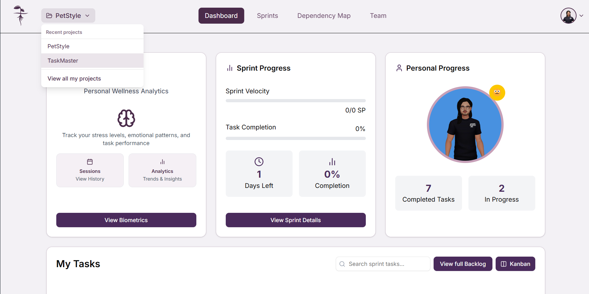
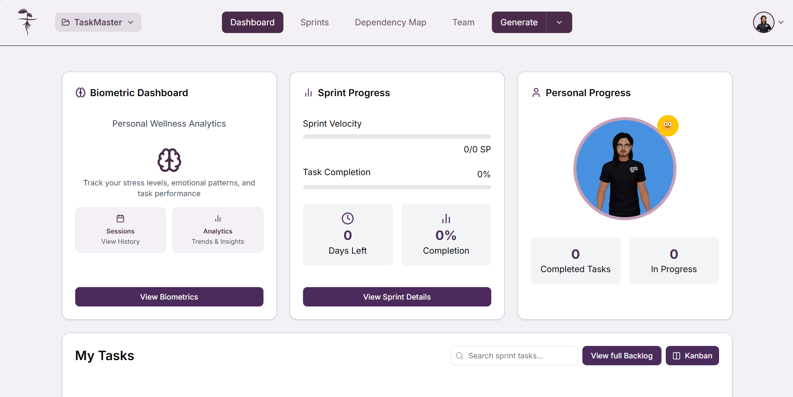
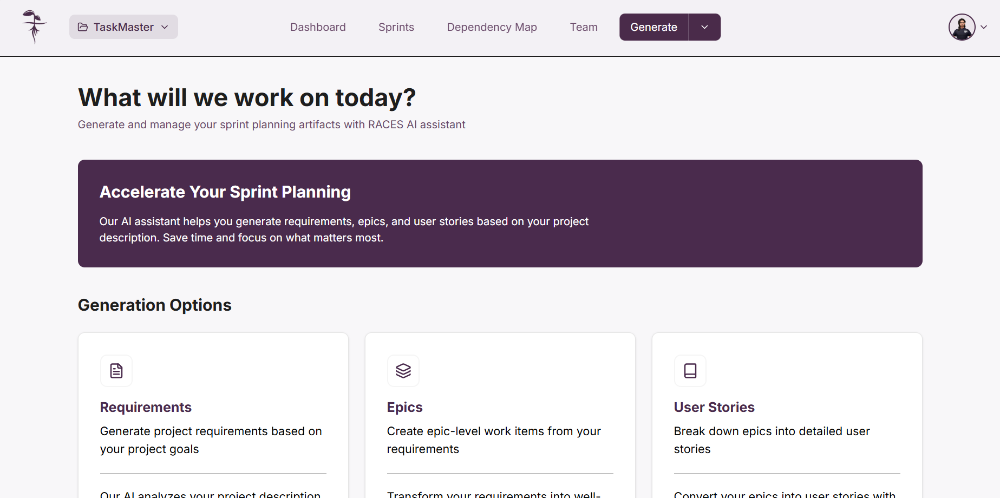
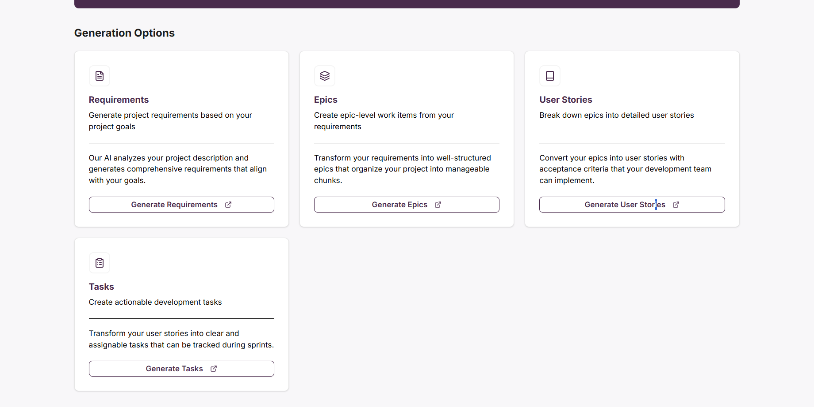

## Creación de _items_ con Raices
Cuando usted tenga un proyecto creado, puede usar los requerimientos de su proyecto para empezar a crear los siguientes tipos de _items_ usados dentro de la métodología **SCRUM** :
- Épicas
- Historias de Usuario
- Tareas

Para esto el sistema ofrece el uso de una **inteligencia artificial generativa** que en base a la descrición de su proyecto podrá generar los requerimientos de este y consecuentemente podrá generar todos los _items_ necesarios para su proyecto.

## Acceder a la creación de _items_

### Seleccionar un proyecto

En la vista de proyectos, seleccione el proyecto en el cuál desea empezar a generar _items_; haga esto dando click sobre la tarjeta de proyecto en la pantalla "**_Projects_**"

Alternativamente puede seleccionar el proyecto donde va a trabajar desde la barra de navegación de la página dando click en el boton con el nombre de su proyecto actual y seleccionando el proyecto donde desea trabajar.

### Acceder a la generación de _items_
Tras seleccionar el poryecto deseado será llevado a la pantalla "**_Dashboard_**", ahí usted deberá seleccionar la opción "**_Generate_**" dentro de la barra de navegación de la página

Una vez seleccionada la opción "**_Generate_**" será llevado a la pantalla con las opciones de generación de items. Una vez ahí seleccione el tipo de _item_ que desea empezar a crear

Vista "**_Generate_**"

_Items_ para generar
