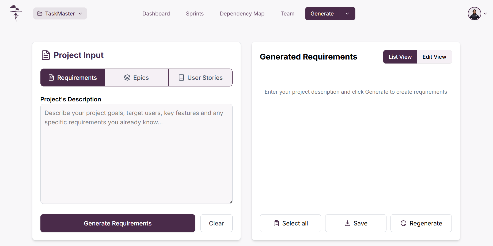

Para acceder a la generación de requerimientos, de click en la opción "**_Generate Requirements_**" dentro de la vista "**_Generate_**"

Una vez seleccionado, llegará a la vista de "**_Generate Requirements_**". Aquí usted dispondrá de la opción de permitir que la inteligencia artificial generativa del proyecto le ayude a generar los requerimientos o puede ingresarlos de forma manual.

## Agregar Requerimientos

### Agregar requerimientos con inteligencia artificial.

Para agregar requerimientos usando la inteligencia artificial, necesita escribir una descripción del proyecto donde deje claro sus **objetivos**, **usuarios objetivos**, **fucniones clave**, y **cualquier requerimiento específico** que tenga en mente para su proyecto. Una vez tenga la descripción ingresela en el campo de texto y de click en "**_Generate Requirements_**

Tras esto se abrirá una venta emergente pidiendo la confirmación ya que generar nuevos requerimientos sobreescribirá los que ya se tenían hechos, de click en "**_Generate_**" para confirmar la generación. A continuación tendrá que esperar en lo que la inteligencia artificial procesa los requerimientos encontrados

Una vez concluido el proceso podrá ver los requerimientos generados, estos incluyen requerimientos funcionales como tambien no funcionales. En la lista generada usted podrá **[seleccionar los requerimientos](#seleccionar-requerimientos)** con los que este conforme o editar los requerimientos para ajustarlos.

#### Volver a generar requerimientos con inteligencia artificial

Puede volver a generar los requerimientos generados por la inteligencia artificial para obtener requerimientos diferentes si siente que los generados no cumplen con lo que busca. Para esto de click en el boton "**_Regenerate_**". Esto abrira una ventana emergente para que confirme si usted desea proceder, de click en "**_Generate_**" para volverlos a generar.

Boton "**_Regenerate_**"

Mensaje de confrimación

:::warning Cuidado

Volver a generar los requerimientos hará que se sobreescriba la lista presentada actualmente y no podrá recuperarlos

:::

### Agregar requerimientos manualmente

Puede agregar los requerimientos del proyecto de manera manual, para esto de click en "**_Edit View_**" y despues en "**_+ Add Manually_**"; esto abrirá un formulario para añadir los detalles del requerimiento. Una vez haya terminado de agregar los detalles de click en "**_Add_**".

Vista de edición y opción de añadir requerimiento

Vista del formulario para añdir requerimiento

## Editar requerimientos
Puede editar los requerimientos creados desde la vista de edición. Para esto será necesario que de click en "**_Edit View_**", despues de esto de click sobre el ícono de lapiz para abrir el formulario de edición; una vez haya terminado de editar la información del requerimiento de click en "**_Save_**"

Vista de edición de requerimientos:

Formulario de edición y botón **_Save_**

## Eliminar Requerimientos
Puede eliminar requerimientos desde la vista de edición. Haga click en "**_Edit View_**" y de click sobre el ícono de lapiz para abrir el formulario de edición, una vez ahí de click en "**_Delete_**" para eliminar el requerimiento deseado.

Vista de edición de requerimientos:

Formulario de edición y botón "**_Delete_**"

:::warning Cuidado

Al eliminar un requerimiento no es posible recuperarlo

:::

## Seleccionar requerimientos

Cuando tenga requerimientos agregados, seleccionelos dando click sobre ellos o puede decidir seleccionar todos haciendo click en el boton "**_Select all_**" lo cuál generará una alerta avisandole que se han seleccionado todos.

Para deshacer la selección de requerimientos de click sobre el requerimiento a eliminar de la selección.

Selección de requerimientos

Boton "**_Select All_**" y mensaje de confirmación

## Guardar requerimientos
Cuando este conforme con su selección de requerimientos generados, guardelos dando click en el botón "**_Save_**"; esto abrirá una ventana emergente preguntando por confirmación, de click en "**_Save_**". Asegurese que todos los requerimientos que desea conservar esten seleccionados correctamente. 

Boton "**_Save_**"

Mensaje de confirmación para guardar requerimientos

:::info Importante

Recuerde que solo se guardarán los requerimientos seleccionados

:::

## Eliminar todos los requerimientos y limpiar el cuadro de texto.
Puede usar el boton "**_Clear_**" para eleminar todos los requerimientos y el cuadro de texto con la descripción de tu proyecto. Al dar click en el botón "**_Clear_**" se le mostrará una ventana emergente para confirmar la elimnicación de todos los requerimientos y la información dentro del cuadro de texto, de click en "**_Confirm_**" para eliminar todos los requerimientos y limpiar el texto del cuadro de texto.

Boton "**_Clear_**"

Vista confirmación de eliminación de todos los requerimientos

:::warning Cuidado

Eliminar todos los requerimientos y limpiar el cuadro de texto es un proceso no reversible y la información se perderá. Puede guardar los requerimientos si desea conservarlos.

:::