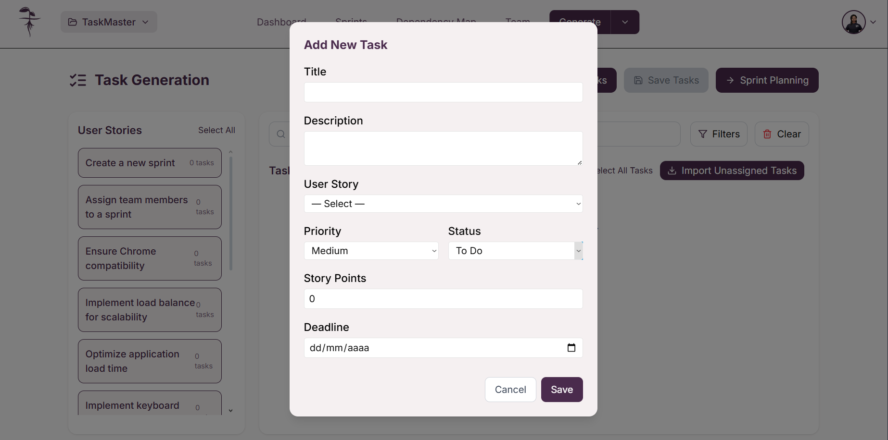

Para acceder a la generación de tareas, de click en la opción "**_Generate Tasks_**" dentro de la vista "**_Generate_**"

Alternativamente, puede acceder desde la barra de navegación en "**_Generate_**" abriendo el menú y seleccionando "**_Generate Tasks_**"

Una vez seleccionado, llegará a la vista de "**_Task Generation_**". Aquí usted dispondrá de las historias de usuario disponibles en una lista donde podrá seleccionarlas para generar tareas mediante inteligencia artificial.
 

:::info

Para generar tareas necesita tener historias de usuario disponibles. Si no cuenta con ellas, puede crearlas en la [pantalla de generación de historias de usuario](UserStories)

:::

## Seleccionar historias de usuario

En la página de generación de tareas podrá ver todas las historias de usuario en una lista donde podrá seleccionarlas dando click sobre cada tarjeta o alternativamente podrá seleccionarlas todas dando click en el botón "**_Select All_**".

Para deshacer la selección de historias de usuario de click sobre la historia a eliminar de la selección.

Lista de historias de usuario

Botón "**_Select All_**"

## Generar tareas

### Generar tareas con inteligencia artificial

Para generar tareas usando la inteligencia artificial, asegúrese de tener **historias de usuario seleccionadas** ya que estas servirán como entrada para el proceso de generación. Una vez tenga las historias de usuario necesarias, de click en "**_Generate Tasks_**"

Tras esto se abrirá una ventana emergente pidiendo la confirmación ya que generar nuevas tareas sobreescribirá las que ya se tenían hechas, de click en "**_Generate_**" para confirmar la generación. A continuación tendrá que esperar mientras la inteligencia artificial procesa y genera las tareas
 

Una vez concluido el proceso podrá ver las tareas generadas en base a las historias de usuario seleccionadas. Todas las tareas se encontrarán seleccionadas inicialmente.

### Agregar tareas manualmente

Puede agregar tareas del proyecto de manera manual, para esto de click en "**_Add Task_**" o "**_Add Task Manually_**"; esto abrirá un formulario para añadir los detalles de la tarea. Una vez haya terminado de agregar los detalles de click en "**_Save_**".

Botón "**_Add Task Manually_**"

Vista del formulario para añadir tarea

## Buscar y filtrar tareas

### Buscar tareas por nombre

Para buscar tareas por nombre específico, ingrese el nombre de la tarea dentro de la barra de búsqueda "**_Search tasks..._**".

Barra de búsqueda

### Filtrar tareas

Para hacer uso de los filtros necesitará dar click en el botón "**_Filters_**" el cual le permitirá buscar por prioridad o historia de usuario asociada. De igual manera puede decidir limpiar todos los filtros dando click en "**_Clear_**".

Botón "**_Filters_**"

Opciones de filtros

## Editar tareas

Puede editar las tareas generadas dando click sobre el ícono del lápiz en la tarea deseada, lo cual abrirá un formulario donde deberá pulsar "**_Save_**" para guardar los cambios realizados.

Ícono de edición

Formulario de edición

## Eliminar tareas

### Eliminar tareas individuales

Para eliminar tareas individualmente puede dar click sobre el botón con el ícono de bote de basura en la tarea correspondiente.

Ícono de eliminación

:::warning CUidado

Al borrar una tarea no se generará ninguna ventana de generación y directamente se eliminará la tarea

:::

### Eliminar todas las tareas

Puede decidir eliminar todas las tareas creadas dando click en el botón "**_Clear All_**" o "**_Clear_**" lo cual eliminará todas las tareas. Se le mostrará una ventana emergente para confirmar la eliminación, de click en "**_Confirm_**" para proceder.

Botón "**_Clear All_**"

Confirmación de eliminación

:::warning Cuidado

Eliminar todas las tareas es un proceso no reversible y toda la información se perderá

:::

## Seleccionar tareas

Una vez haya creado las tareas, todas se encontrarán seleccionadas inicialmente. Usted podrá seleccionar cuáles tareas desea conservar dando click sobre la tarea correspondiente para deseleccionarla.

Para deseleccionar todas las tareas puede usar el botón "**_Deselect All Tasks_**".

Botón "**_Deselect All Tasks_**"

Tareas seleccionadas y deseleccionadas

## Importar tareas no asignadas

También puede importar las tareas que no estén asignadas y ya estén guardadas en la base de datos para poder integrarlas al sprint planning dando click en "**_Import Unassigned Tasks_**".

Botón "**_Import Unassigned Tasks_**"

## Guardar tareas

Una vez esté conforme con las tareas creadas, podrá guardarlas en la base de datos dando click en "**_Save Tasks_**". Esto abrirá una ventana emergente preguntando por confirmación, de click en "**_Save_**". Una vez haya guardado las tareas será llevado automáticamente al proceso de "**_Sprint planning_**".

Botón "**_Save Tasks_**"

Mensaje de confirmación para guardar tareas

:::info Importante

Recuerde que solamente se van a guardar las tareas que estén seleccionadas

:::

## Proceder al Sprint Planning

Una vez haya guardado las tareas deseadas, podrá dar click en "**_Sprint Planning_**" para proceder a la planeación del sprint.

Botón "**_Sprint Planning_**"

:::note

El botón de Sprint Planning le llevará a la siguiente fase del proceso de gestión ágil del proyecto

:::

