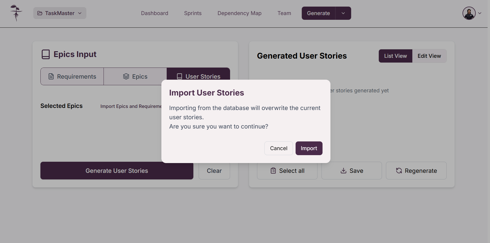

Para acceder a la generación de historias de usuario, de click en la opción "**_Generate User Stories_**" dentro de la vista "**_Generate_**"

Alternativamente, si ya está dentro de la pantalla de épicas puede dar click sobre el botón "**_User Stories_**" en la cintilla de opciones.

Una vez seleccionado, llegará a la vista de "**_Generate User Stories_**". Aquí usted dispondrá de las épicas seleccionadas previamente que servirán como base para generar las historias de usuario mediante inteligencia artificial.

:::info

Si desea cambiar las épicas seleccionadas, necesita repetir el [proceso de selección de épicas en la pantalla de generación de épicas](Epics/#seleccionar-épicas)

:::

## Importar épicas y requerimientos

Si no cuenta con épicas seleccionadas, puede importar todas las épicas y requerimientos guardados en la base de datos dando click en el botón "**_Import Epics and Requirements_**". Esto abrirá una ventana emergente para confirmar la importación de todas las épicas y requerimientos disponibles para el proyecto, de click en "**_Import_**" para confirmar.

Botón "**_Import Epics and Requirements_**"

Confirmación para importar épicas y requerimientos

## Importar historias de usuario

También puede importar historias de usuario ya guardadas en la base de datos dando click en el botón "**_Import User Stories_**". Esto abrirá una ventana emergente pidiendo confirmación ya que sobreescribirá todas las historias de usuario que se encuentren actualmente en la página, de click en "**_Import_**" para confirmar.

Botón "**_Import User Stories_**"

Confirmación para importar historias de usuario

:::warning Cuidado

Importar historias de usuario sobreescribirá todas las historias de usuario actuales en la página

:::

## Generar historias de usuario

### Generar historias de usuario con inteligencia artificial

Para generar historias de usuario usando la inteligencia artificial, asegúrese de tener **épicas seleccionadas** ya que estas servirán como entrada para el proceso de generación. Una vez tenga las épicas necesarias, de click en "**_Generate User Stories_**"

Tras esto se abrirá una ventana emergente pidiendo la confirmación ya que generar nuevas historias de usuario sobreescribirá las que ya se tenían hechas, de click en "**_Generate_**" para confirmar la generación. A continuación tendrá que esperar mientras la inteligencia artificial procesa y genera las historias de usuario

Una vez concluido el proceso podrá ver las historias de usuario generadas en base a las épicas seleccionadas. En la lista generada usted podrá **[seleccionar las historias de usuario](#seleccionar-historias-de-usuario)** con las que esté conforme o editar las historias para ajustarlas.

#### Volver a generar historias de usuario con inteligencia artificial

Puede volver a generar las historias de usuario generadas por la inteligencia artificial para obtener historias diferentes si siente que las generadas no cumplen con lo que busca. Para esto de click en el botón "**_Regenerate_**". Esto abrirá una ventana emergente para que confirme si usted desea proceder, de click en "**_Generate_**" para volverlas a generar.

Botón "**_Regenerate_**"

Mensaje de confirmación
 

:::warning Cuidado

Volver a generar las historias de usuario hará que se sobreescriba la lista presentada actualmente y no podrá recuperarlas

:::

### Agregar historias de usuario manualmente

Puede agregar historias de usuario del proyecto de manera manual, para esto de click en "**_Edit View_**" y después en "**_+ Add Manually_**"; esto abrirá un formulario para añadir los detalles de la historia de usuario. Una vez haya terminado de agregar los detalles de click en "**_Add_**".

Vista de edición y opción de añadir historia de usuario

Vista del formulario para añadir historia de usuario

## Editar historias de usuario

Puede editar las historias de usuario creadas desde la vista de edición. Para esto será necesario que de click en "**_Edit View_**", después de esto de click sobre el ícono de lápiz para abrir el formulario de edición; una vez haya terminado de editar la información de la historia de usuario de click en "**_Save_**"

Vista de edición de historias de usuario:

Formulario de edición y botón "**_Save_**"

## Eliminar historias de usuario

Puede eliminar historias de usuario desde la vista de edición. Haga click en "**_Edit View_**" y de click sobre el ícono de lápiz para abrir el formulario de edición, una vez ahí de click en "**_Delete_**" para eliminar la historia de usuario deseada.

Vista de edición de historias de usuario:

Formulario de edición y botón "**_Delete_**"

:::warning Cuidado

Al eliminar una historia de usuario no es posible recuperarla

:::

## Seleccionar historias de usuario

Cuando tenga historias de usuario agregadas, selecciónelas dando click sobre ellas o puede seleccionar todas haciendo click en el botón "**_Select all_**".

Para deshacer la selección de historias de usuario de click sobre la historia a eliminar de la selección.

Selección de historias de usuario

Botón "**_Select All_**"
 

## Guardar historias de usuario

Cuando esté conforme con su selección de historias de usuario generadas, guárdelas dando click en el botón "**_Save_**"; esto abrirá una ventana emergente preguntando por confirmación, de click en "**_Save_**". Asegúrese que todas las historias de usuario que desea conservar estén seleccionadas correctamente.

Botón "**_Save_**"

Mensaje de confirmación para guardar historias de usuario

:::info Importante

Recuerde que solo se guardarán las historias de usuario seleccionadas

:::

## Eliminar todas las historias de usuario, épicas y requerimientos

Puede usar el botón "**_Clear_**" para eliminar todas las historias de usuario, épicas y requerimientos, independientemente de si están seleccionados o no. Al dar click en el botón "**_Clear_**" se le mostrará una ventana emergente para confirmar la eliminación de todo el contenido, de click en "**_Confirm_**" para eliminar todo.

Botón "**_Clear_**"

Vista confirmación de eliminación de todas las historias de usuario, épicas y requerimientos

:::warning Cuidado

Eliminar todas las historias de usuario, épicas y requerimientos es un proceso no reversible y toda la información se perderá. Puede guardar las historias de usuario si desea conservarlas.

:::

