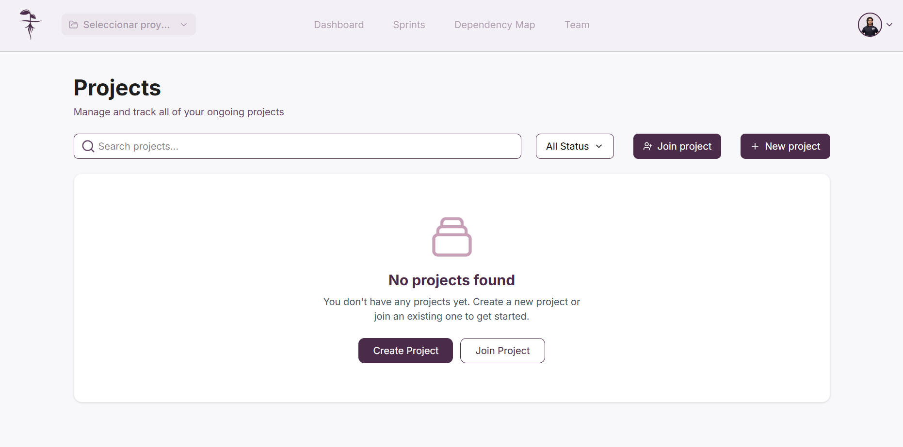
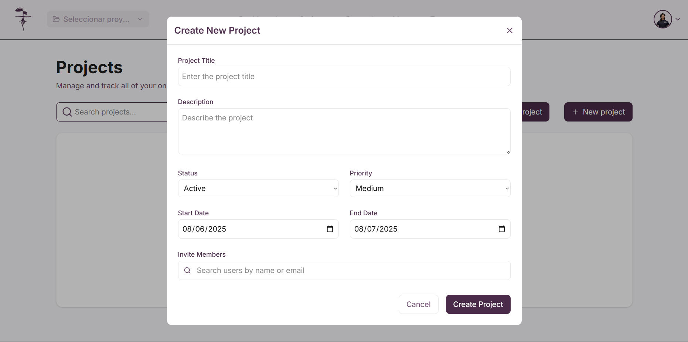

# Creando un proyecto

Para crear un proyecto, de click en el boton "**_Create Project_**", alternativamente si ya cuenta con proyectos de click en la opción "**_New project_**" 

Rellene el formulario con la información de su proyecto y agrege a las personas que desea incluir en este. De click en "**_Create Project_** para crear su proyecto. Una vez creado su proyecto tambien se le asignará automáticamente un equipo.

:::info Consideraciones importantes

Al crear un proyecto, se le asignará automáticamente a usted los permisos de administrador.

:::