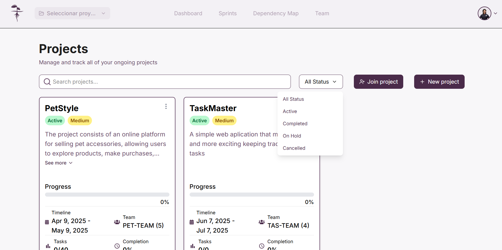
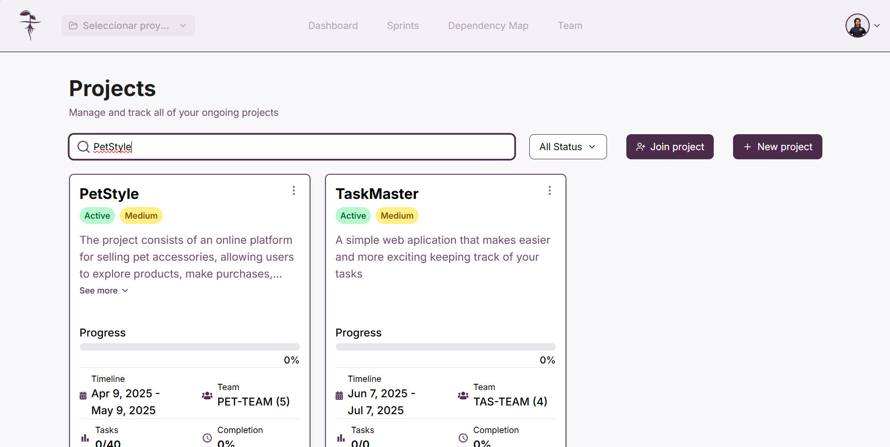

La plataforma cuenta con la opción de filtrar proyectos por su estado así como tambien buscar proyectos por nombre.

## Filtrar por estado

De click en "**_All status_**" y en el menú desplegable seleccione la opción deaseada para aplicar los filtros

## Busqueda por nombre
De click en la barra de busqueda "**_Search projects_**" e ingrese el nombre del proyecto a buscar, tras esto pulse **_Enter_**

