## Invitar a un proyecto

Puede invitar a miembros adicionales a un proyecto, de click en el simbolo de los tres puntos en la tarjeta de su proyecto y seleccione la opción "**_Invite_**". Esto le mostrará un código de invitación al proyecto el cuál podrá copiar para enviar a su equipo.

Opción "**_Invite_**"
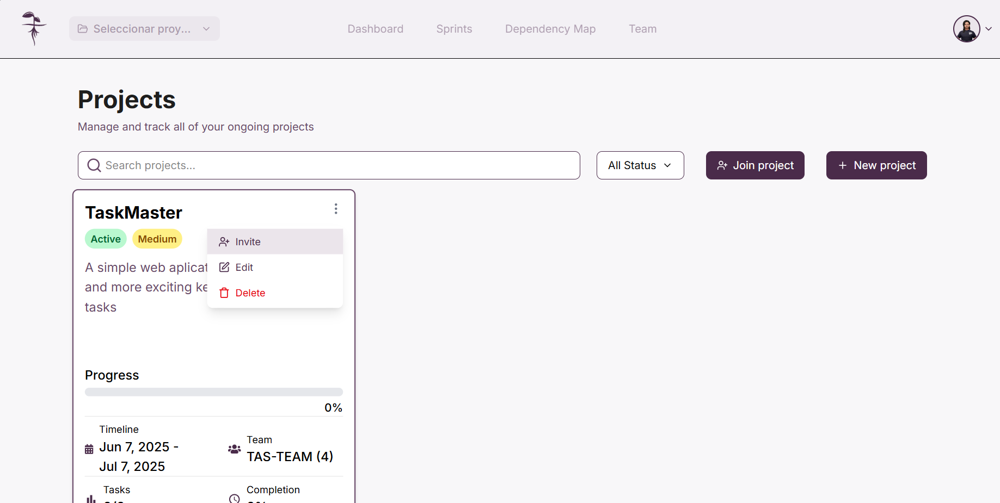

Código de invitación
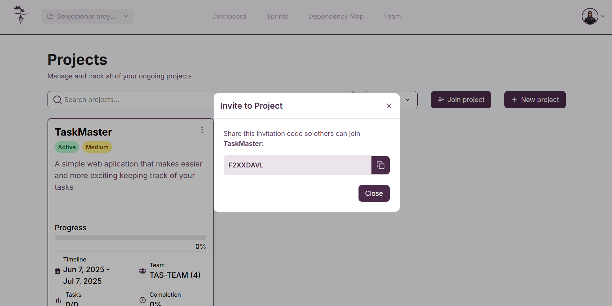

:::note Importante

Solo puede crear códigos de invitación si usted tiene permisos de administrador dentro del proyecto.

:::

## Unirse a un proyecto

Puede unirse a un proyecto mediante el código de invitación de un proyecto. Para introducir un código de invitación a un proyecto de click en "**_Join project_**", ingrese su código y de click a "**_Next_**", tras esto se mostrara una ventana emergente con información del proyecto donde deberá dar click en "**_Accept Invitation_**" para poder entrar al proyecto.

Ingresar un código de invitación
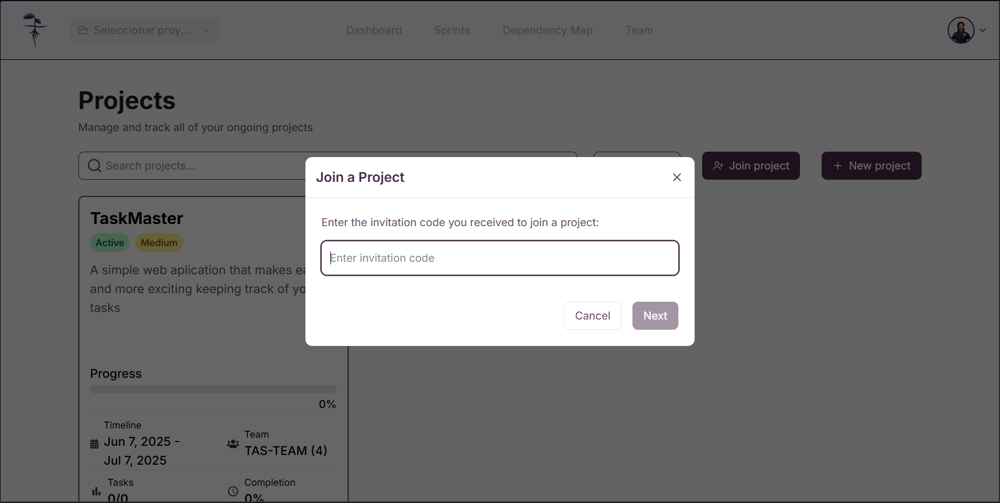

Confirmación de invitación
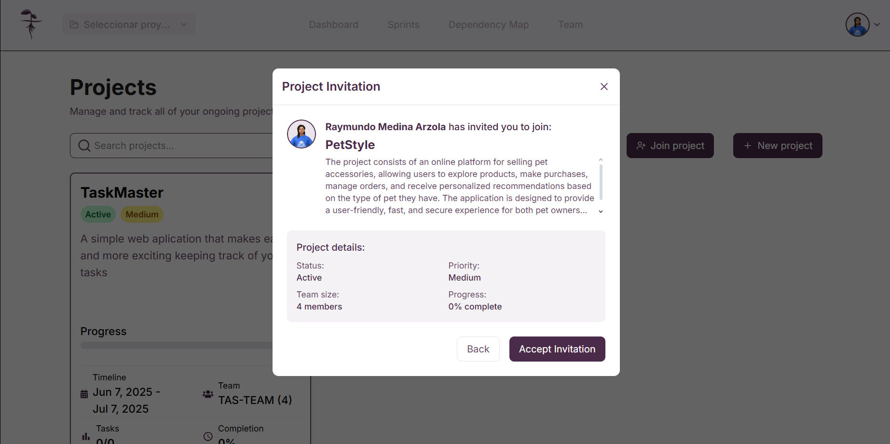

## Elimnar un proyecto

Puede eliminar sus proyectos, para esto de click en el símbolo de los tres puntos en la tarjeta de su proyecto y seleccione la opción "**_Delete_**" y en la ventana emergente seleccione "**_Delete_**"

Opción "**_Delete_**"
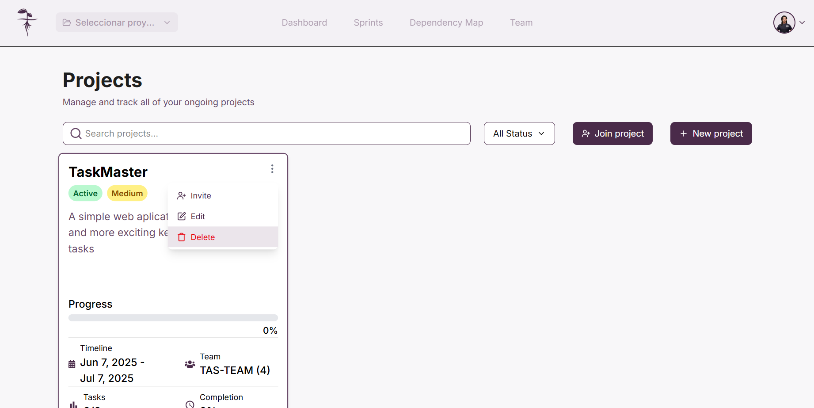

Confirmación para eliminar un proyecto
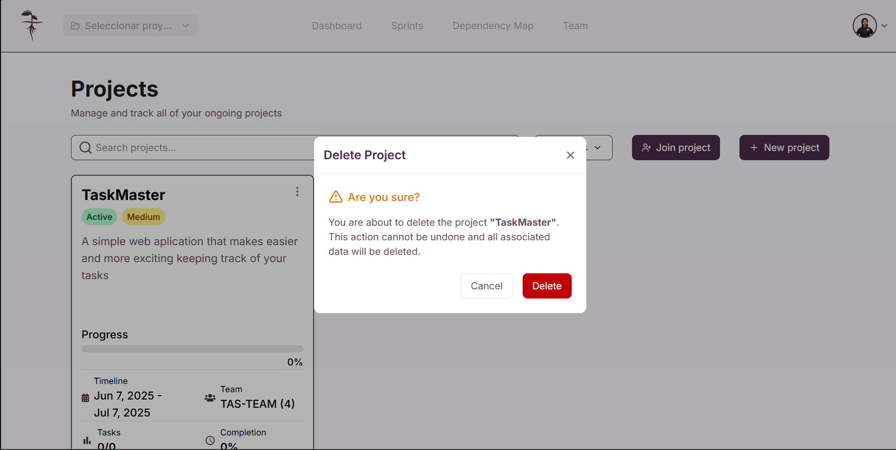

:::warning Cuidado

Solo puede eliminar un proyecto si usted cuenta con permisos de administrador dentro del proyecto, eliminar un proyecto lo borra de forma permanente e irreversible.

:::

## Editar un proyecto

Puede editar un proyecto para cambiar la información general de este, de click en los tres puntos en la tarjeta de su proyecto y seleccione la opción "**_Edit_**", ahí se le presentará en una ventana emergente un formulario con los detalles de su proyecto que usted podrá alterar. Una vez haya terminado guarde sus cambios dando click en "**_Save changes_**".

Opción "**_Edit_**"
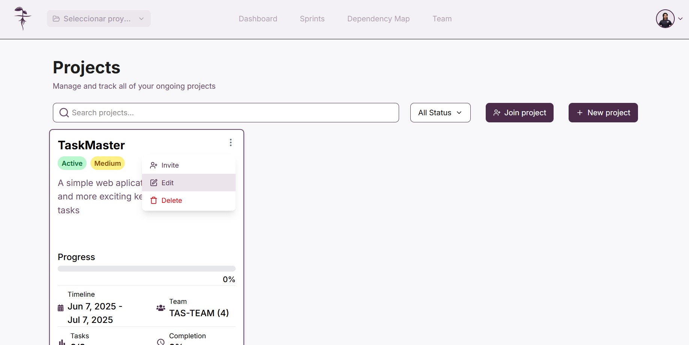

Formulario de edición
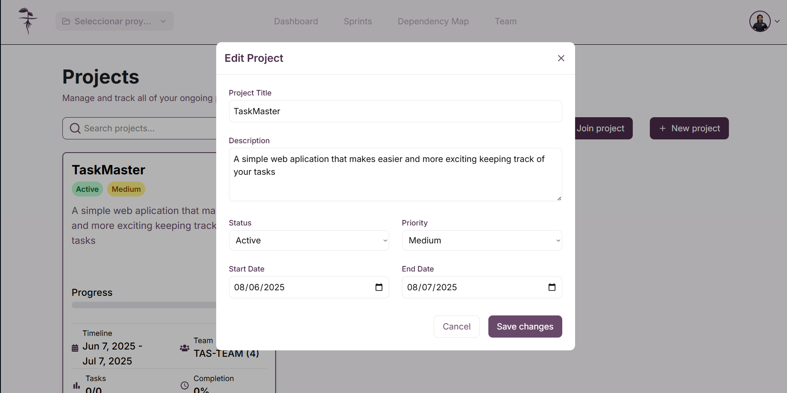

:::note Importante

Solo puede editar un proyecto si usted cuenta con permisos de adminstrador dentro del proyecto. Además para añadir miembros adicionales será necesario agregarlos mediante el código de invitación

:::

## Abandonar un proyecto

Puede abandonar un protyecto, de click en los tres puntos de la tarjeta de su proyecto y seleccione la opción "**_Leave project_**", tras esto se le mostrará una venta emergente donde deberá hacer click en "**_Leave project_**.

Opción "**_Leave project_**"
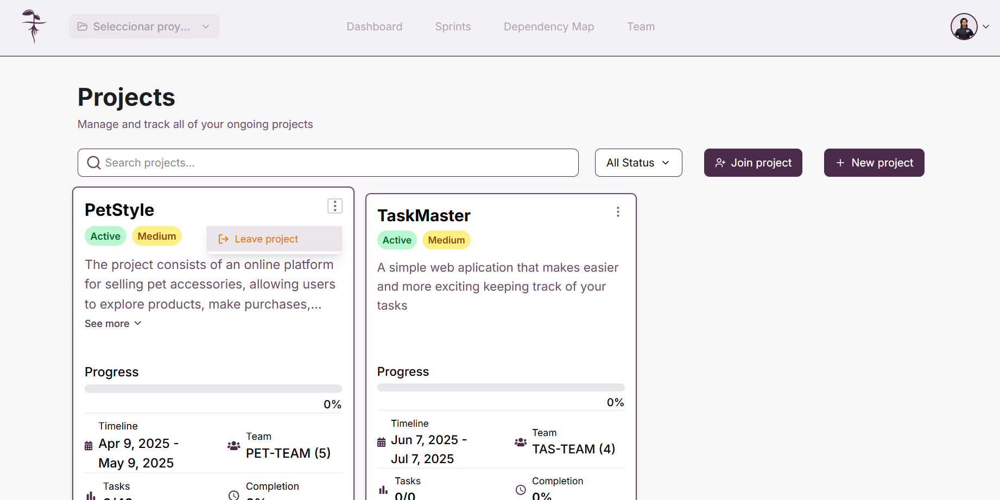

Confirmación "**_Leave project_**"
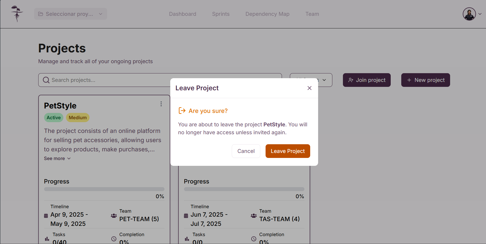

:::warning Cuidado

Abandonar un proyecto le quitará acceso a este

:::

## Seleccionar un proyecto

Para poder acceder a las demás funciones de la plataforma es necesario que usted seleccione un proyecto donde trabajar, para esto en la vista de "**_Projects_**" seleccione el proyecto donde desea trabajar.
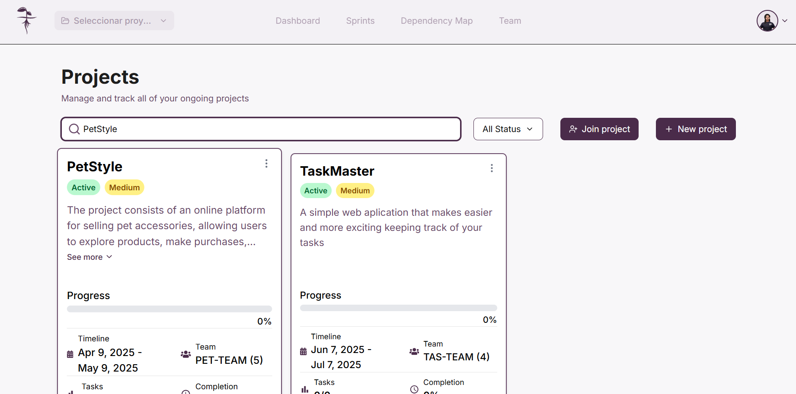

Alternativamente puede seleccionar el proyecto donde va a trabajar desde la barra de navegación de la página dando click en el boton con el nombre de su proyecto actual y seleccionando el proyecto donde desea trabajar.
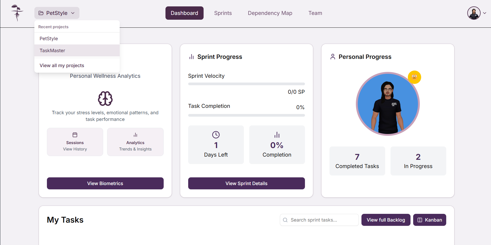