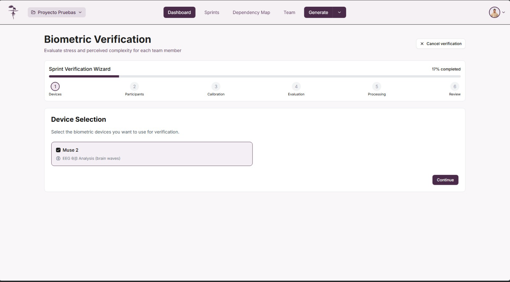
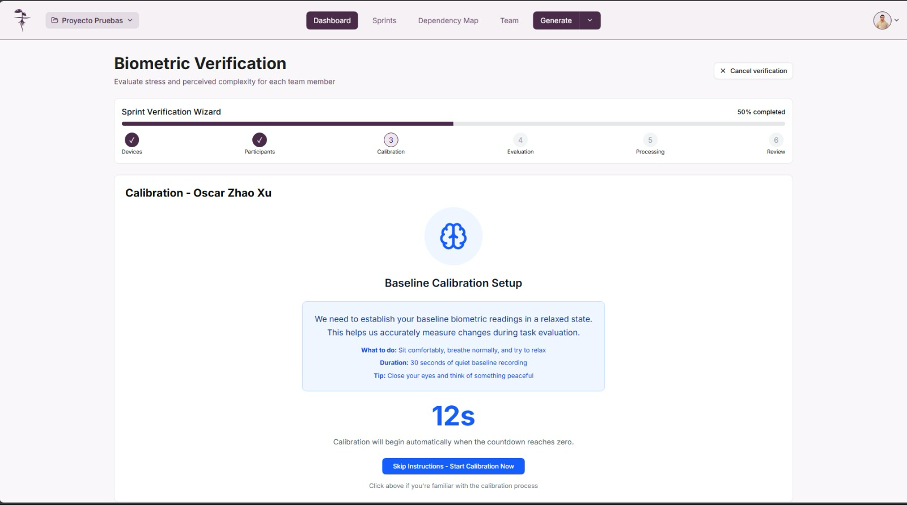
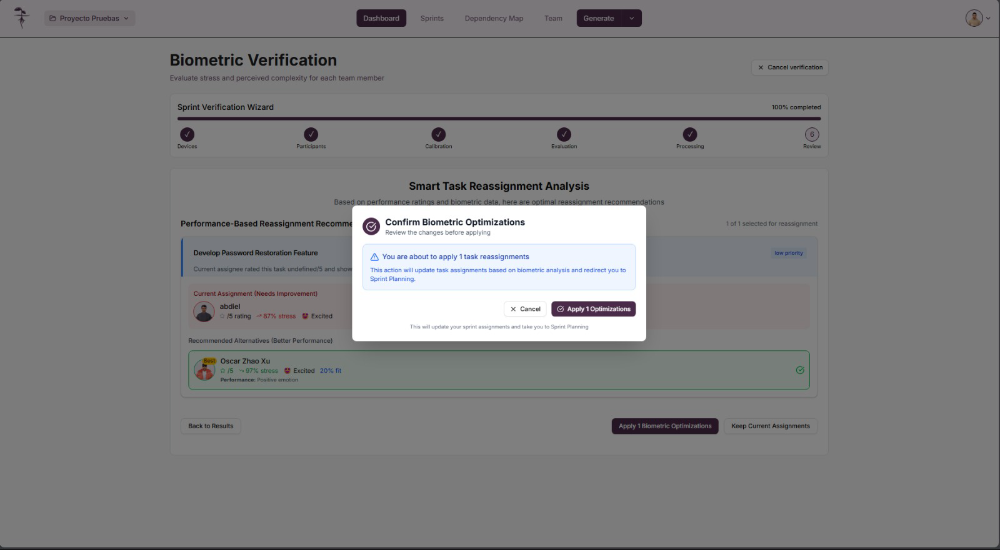

La asignación biométrica es un proceso avanzado que permite optimizar la distribución de tareas en el sprint basándose en datos biométricos y respuestas emocionales de los miembros del equipo. Este proceso se ejecuta después de la asignación manual de tareas y es completamente opcional.

## Acceso a la asignación biométrica

La asignación biométrica se puede ejecutar después de completar la asignación manual de tareas en el Sprint Planning. Esta funcionalidad está disponible como un paso adicional para mejorar la distribución de tareas basándose en datos científicos.

:::info Proceso opcional

La asignación biométrica es un proceso opcional que complementa la asignación manual de tareas. Puede omitirse si prefiere mantener las asignaciones manuales originales.

:::

## Configuración inicial

### Selección de dispositivos biométricos

El primer paso es configurar el dispositivo biométrico que se utilizará durante la evaluación.

#### Dispositivo EEG integrado

El sistema utiliza un dispositivo especializado que combina múltiples sensores:

##### Análisis EEG (Electroencefalografía)
- **Electrodos TP9 y TP10**: Ubicados en las regiones temporales para captar actividad cerebral lateral
- **Electrodos AF7 y AF8**: Posicionados en la región frontal para monitorear funciones ejecutivas
- **Ondas cerebrales analizadas**:
  - **Delta (0.5-4 Hz)**: Asociadas con relajación profunda y procesamiento inconsciente
  - **Theta (4-8 Hz)**: Relacionadas con creatividad y estado de flow
  - **Alpha (8-13 Hz)**: Indicadores de relajación consciente y concentración
  - **Beta (13-30 Hz)**: Vinculadas con atención activa y procesamiento cognitivo
  - **Gamma (30-100 Hz)**: Relacionadas con procesamiento de alta complejidad

##### Sensores complementarios
- **Frecuencia cardíaca**: Monitoreo continuo del ritmo cardíaco para evaluar estrés cardiovascular
- **Sensor de movimiento**: Detección de actividad física y niveles de inquietud durante la evaluación

#### Configuración del dispositivo

Para configurar el dispositivo EEG integrado:
1. **Colocación de electrodos**: Asegurar posicionamiento correcto de los 4 electrodos EEG
2. **Verificar conectividad**: Confirmar que todos los sensores estén transmitiendo datos
3. **Calibrar sensores**: Ajustar la sensibilidad según las características individuales del participante
4. **Validar señales**: Verificar la calidad de las ondas cerebrales, frecuencia cardíaca y datos de movimiento

### Selección de participantes

Configure qué miembros del equipo participarán en la evaluación biométrica.

#### Criterios de participación

Considere los siguientes factores:
- **Disponibilidad**: Tiempo para completar el proceso completo
- **Comodidad**: Disposición a usar dispositivos biométricos
- **Relevancia**: Miembros con tareas asignadas en el sprint
- **Representatividad**: Diversidad de roles en el equipo

#### Configuración de sesión

Para cada participante:
- **Orden de evaluación**: Secuencia en que participarán
- **Tiempo estimado**: Duración proyectada por participante
- **Configuraciones específicas**: Ajustes personalizados por miembro

## Calibración de dispositivos

### Proceso de calibración inicial

Antes de comenzar la evaluación, cada dispositivo debe calibrarse correctamente para obtener lecturas precisas.

#### Pasos de calibración

1. **Conexión de sensores**: Colocar los dispositivos según las instrucciones
2. **Período de adaptación**: Permitir que el participante se acostumbre
3. **Lectura base**: Establecer valores de referencia en estado neutral

### Validación de señales

#### Verificación de calidad

El sistema valida:
- **Intensidad de señal**: Que las lecturas sean claras y consistentes
- **Ruido de fondo**: Minimización de interferencias externas
- **Estabilidad**: Consistencia en las mediciones base

### Confirmación final

#### Preparación para evaluación

Una vez calibrados todos los dispositivos:
- **Resumen de configuración**: Verificar todos los parámetros
- **Estado de dispositivos**: Confirmar funcionamiento óptimo
- **Inicio de sesión**: Proceder con la toma de baseline

## Toma de baseline

### Establecimiento de línea base

El baseline proporciona un punto de referencia para comparar las respuestas durante la evaluación de tareas.

#### Proceso de baseline

Durante esta fase:
1. **Estado de relajación**: El participante debe estar en estado neutral
2. **Medición continua**: Los sensores toman lecturas durante varios minutos
3. **Validación de datos**: El sistema verifica la calidad de las mediciones

#### Importancia del baseline

El baseline permite:
- **Normalización de datos**: Ajustar lecturas según el estado individual
- **Detección de cambios**: Identificar variaciones significativas
- **Personalización**: Adaptar el análisis a cada participante

## Evaluación de tareas

### Instrucciones para la evaluación

Antes de comenzar la evaluación, se proporcionan instrucciones claras sobre el procedimiento.

#### Protocolo de evaluación

Las instrucciones incluyen:
- **Objetivo del proceso**: Evaluar la adecuación personal a cada tarea
- **Uso de dispositivos**: Mantener los sensores conectados durante todo el proceso
- **Criterios de calificación**: Escala del 1 al 5 basada en percepción de dificultad
- **Tiempo por tarea**: Duración recomendada para cada evaluación

### Calificación de tareas

Durante la evaluación, cada participante revisa las tareas asignadas y proporciona una calificación.

#### Escala de dificultad

- **1 - Muy Difícil**: Tarea que genera alta ansiedad o estrés
- **2 - Difícil**: Tarea desafiante que requiere esfuerzo significativo
- **3 - Moderada**: Tarea con dificultad media y manejable
- **4 - Fácil**: Tarea simple con baja complejidad percibida
- **5 - Muy Fácil**: Tarea trivial que no genera estrés

#### Registro simultáneo

Durante la calificación se registran:
- **Respuesta subjetiva**: Calificación del 1 al 5
- **Datos biométricos**: Frecuencia cardíaca, conductancia, etc.
- **Tiempo de respuesta**: Velocidad de toma de decisión
- **Patrones de comportamiento**: Análisis de expresiones faciales

### Cuestionario complementario

Para calificaciones del 1 al 4, se solicita información adicional sobre las razones de la dificultad percibida.

#### Preguntas de seguimiento

El cuestionario explora:
- **Aspectos técnicos**: Complejidad tecnológica de la tarea
- **Conocimiento previo**: Familiaridad con el dominio
- **Recursos necesarios**: Herramientas o información faltante
- **Factores emocionales**: Ansiedad o estrés específico

#### Análisis cualitativo

Esta información permite:
- **Identificar patrones**: Problemas comunes en el equipo
- **Sugerir capacitación**: Áreas de mejora específicas
- **Redistribuir tareas**: Basándose en fortalezas individuales

### Evaluación comparativa

Los participantes posteriores evalúan tareas que otros miembros ya calificaron para crear comparaciones.

#### Propósito de la comparación

Esta fase permite:
- **Validar percepciones**: Confirmar si las dificultades son universales o específicas
- **Identificar fortalezas**: Encontrar miembros mejor adaptados a tareas específicas
- **Optimizar asignaciones**: Redistribuir basándose en aptitudes comparadas
- **Reducir sesgos**: Balancear percepciones individuales con perspectivas grupales

## Análisis de resultados

### Presentación de resultados

Una vez completadas todas las evaluaciones, el sistema presenta un análisis integral de los datos recopilados.

#### Información presentada

Los resultados incluyen:
- **Perfil emocional**: Estado emocional durante cada evaluación
- **Avatar personalizado**: Representación visual del estado emocional
- **Métricas biométricas**: Datos cuantitativos de todos los sensores
- **Recomendaciones**: Sugerencias de reasignación basadas en los datos

### Análisis detallado

#### Métricas clave

El análisis detallado muestra:
- **Correlación emocional**: Relación entre respuesta subjetiva y datos biométricos
- **Patrones de estrés**: Identificación de tareas que generan mayor ansiedad
- **Compatibilidad de equipo**: Análisis de distribución óptima
- **Indicadores de rendimiento**: Predicciones basadas en los datos

## Revisión y confirmación

### Revisión de asignaciones sugeridas

Antes de aplicar los cambios, se presenta una revisión de las nuevas asignaciones recomendadas.

#### Comparación de asignaciones

La revisión muestra:
- **Asignación original**: Distribución manual inicial
- **Asignación sugerida**: Recomendaciones basadas en biométricos
- **Justificación**: Razones para cada cambio propuesto
- **Impacto proyectado**: Efectos esperados en el rendimiento del equipo

### Confirmación final

#### Opciones de implementación

Al finalizar la revisión, puede:
- **Aceptar todas las sugerencias**: Implementar todas las recomendaciones
- **Aceptar parcialmente**: Seleccionar cambios específicos
- **Rechazar cambios**: Mantener las asignaciones originales
- **Guardar para revisión**: Conservar los datos para análisis posterior

#### Consideraciones finales

Antes de confirmar, considere:
- **Factores externos**: Limitaciones no capturadas por los biométricos
- **Preferencias del equipo**: Comodidad de los miembros con los cambios
- **Objetivos del sprint**: Alineación con las metas establecidas
- **Recursos disponibles**: Capacidad real de implementar los cambios

## Beneficios de la asignación biométrica

### Ventajas del proceso

La asignación biométrica proporciona:

#### Objetividad científica
- **Datos cuantitativos**: Mediciones objetivas complementan percepciones subjetivas
- **Reducción de sesgos**: Minimiza decisiones basadas en suposiciones
- **Validación empírica**: Confirma o refuta intuiciones sobre aptitudes

#### Optimización del rendimiento
- **Mejor adaptación**: Tareas asignadas según aptitudes reales
- **Reducción de estrés**: Menor ansiedad al trabajar en tareas adecuadas
- **Mejora de la productividad**: Mayor eficiencia en la ejecución

#### Desarrollo del equipo
- **Autoconocimiento**: Mayor comprensión de fortalezas y debilidades
- **Comunicación mejorada**: Datos objetivos facilitan discusiones sobre capacidades
- **Crecimiento dirigido**: Identificación de áreas de desarrollo específicas

### Limitaciones y consideraciones

#### Factores a tener en cuenta

- **Variabilidad diaria**: El estado emocional puede cambiar día a día
- **Contexto específico**: Los biométricos no capturan todos los factores relevantes
- **Curva de aprendizaje**: La familiaridad con el proceso mejora con el tiempo
- **Factores externos**: Situaciones personales pueden afectar las mediciones

:::tip Uso efectivo

Para maximizar los beneficios de la asignación biométrica, utilícela como una herramienta complementaria a la experiencia y conocimiento del equipo, no como un reemplazo de la toma de decisiones humana.

:::

:::warning Consideraciones importantes

Los datos biométricos son sensibles y deben manejarse con confidencialidad. Asegúrese de que todos los participantes consientan al proceso y comprendan cómo se utilizarán sus datos.

:::