Para acceder a la planeación de sprints, puede ingresar desde el botón "**_Sprint Planning_**" en la pantalla de [generación de tareas](../Generation/Tasks/#proceder-al-sprint-planning), o automáticamente al guardar las tareas generadas.
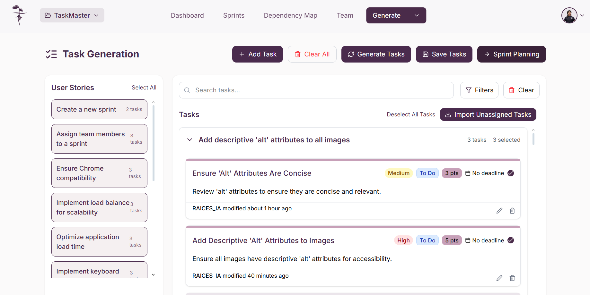

Alternativamente, puede acceder mediante el botón "**_Sprints_**" en la barra de navegación y dando click en "**_Create your first sprint_**"
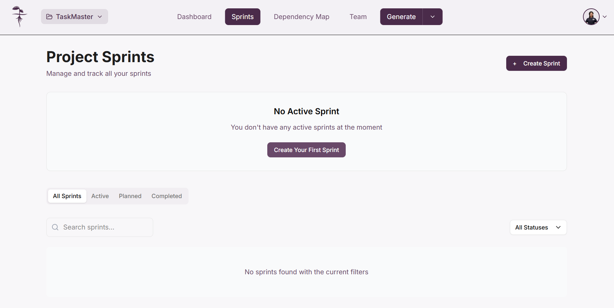

Una vez en la vista de "**_Sprint Planning_**", usted podrá configurar todos los detalles de su sprint y gestionar las historias de usuario y tareas asociadas.
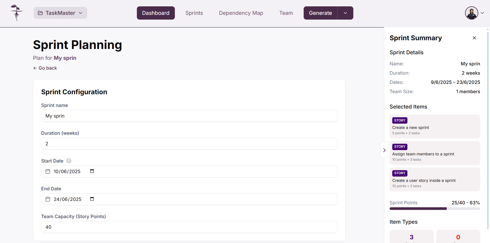

:::info

Para crear un sprint necesita tener historias de usuario disponibles en el product backlog. Si no cuenta con ellas, puede crearlas en la [pantalla de generación de historias de usuario](../Generation/UserStories)

:::

:::warning Importante

Solo podrá crear sprints si cuenta con permiso para hacerlo dentro del proyecto

:::

## Configuración del Sprint

### Definir detalles del sprint

En la sección "**_Sprint Configuration_**" podrá ingresar todos los detalles necesarios para su sprint:

- **Sprint name**: Nombre identificador del sprint
- **Duration (weeks)**: Duración del sprint en semanas
- **Start Date**: Fecha de inicio del sprint
- **End Date**: Fecha de finalización del sprint
- **Team Capacity (Story Points)**: Capacidad total de puntos de historia que puede manejar su equipo

Formulario de configuración del sprint
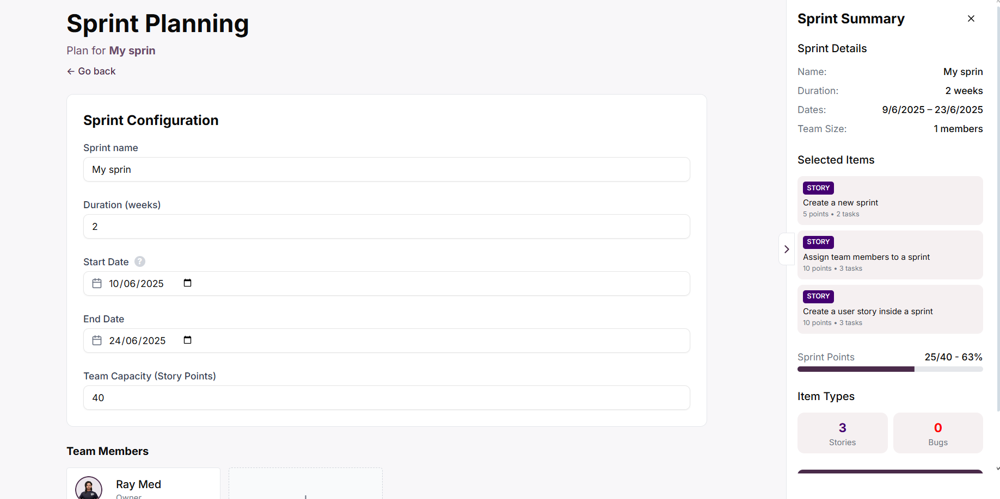

:::warning Solapamiento de fechas
Es importante revisar que las fechas del sprint no se sobrepongan con ningún otro sprint existente, ya que el sistema no permitirá crear el sprint en caso de conflicto y mostrará un toast de error.

:::

### Añadir miembros del equipo

Para añadir miembros a su sprint, pulse el botón "**_Add Member_**" donde tendrá que escoger entre los usuarios disponibles de su equipo.

Botón "**_Add Member_**"
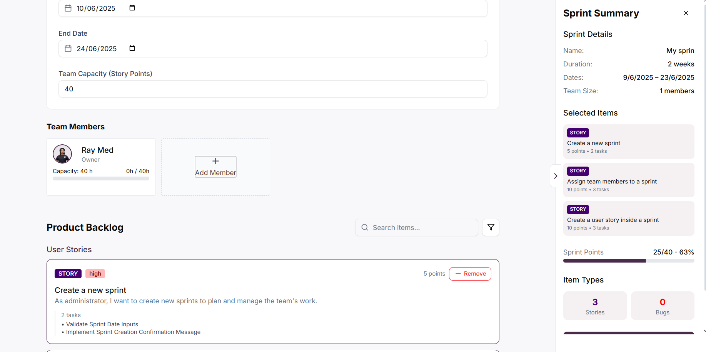

Selección de miembros del equipo
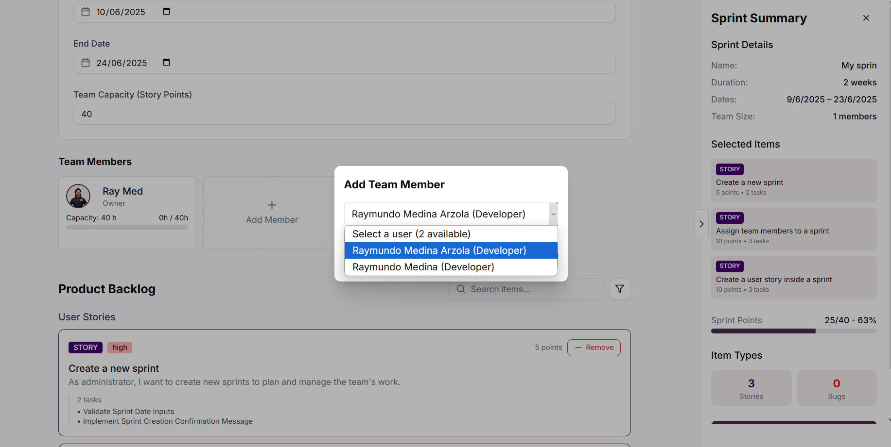

Botón "**_Add_**":
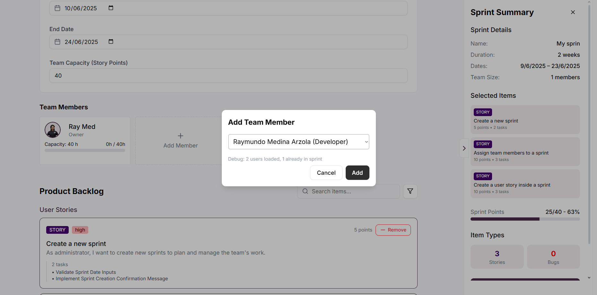

## Gestión del Product Backlog

### Añadir historias de usuario al sprint

En la sección "**_Product Backlog_**" podrá ver todas las historias de usuario disponibles. Para añadir una historia de usuario al sprint, vaya a la tarjeta de la historia deseada y de click en el botón "**_Add_**". Esto automáticamente añadirá sus tareas asociadas al sprint.

Vista del Product Backlog
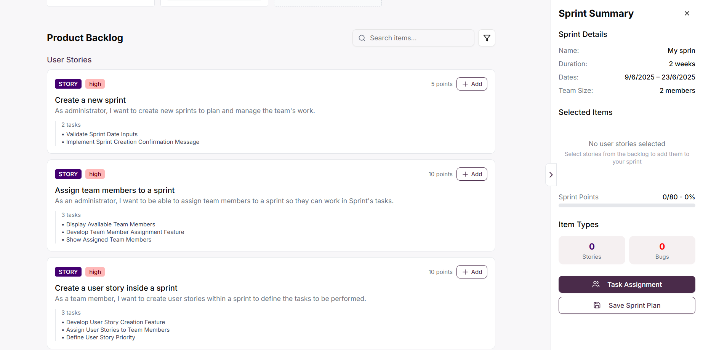

Botón "**_Add_**" en historia de usuario

### Remover historias de usuario del sprint

Si desea remover una historia de usuario del sprint, puede usar el botón "**_Remove_**" en la tarjeta correspondiente dentro de la sección "**_Selected Items_**".

Botón "**_Remove_**"
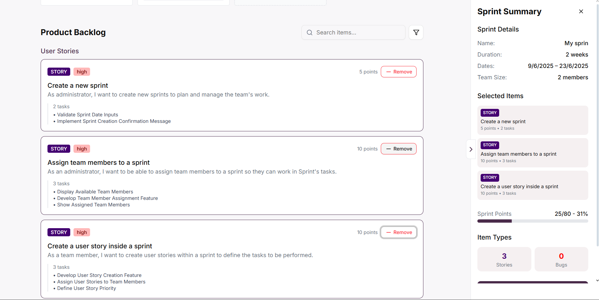

### Buscar en el Product Backlog

Puede buscar historias de usuario específicas usando la barra de búsqueda "**_Search items..._**"

Barra de búsqueda
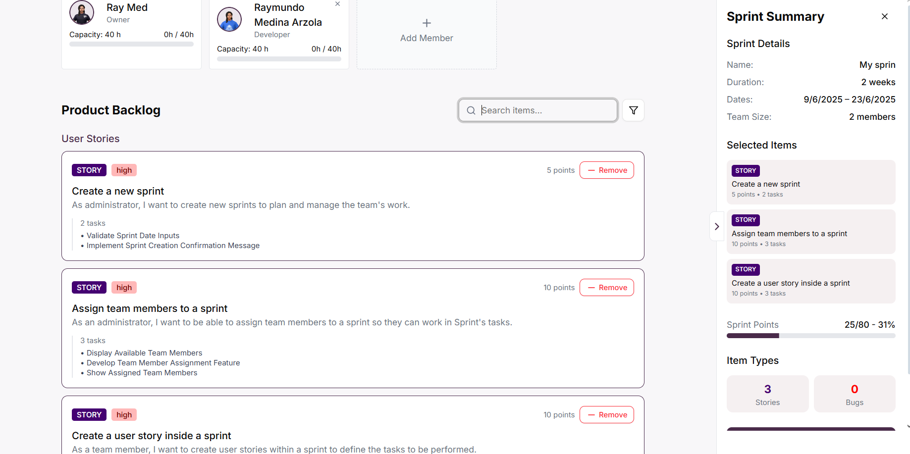

## Asignación de Tareas

### Acceder a la asignación detallada

Una vez haya terminado de añadir miembros y historias de usuario al sprint, de click en "**_Task Assignment_**" para poder asignar las tareas a miembros específicos del equipo.

Botón "**_Task Assignment_**"
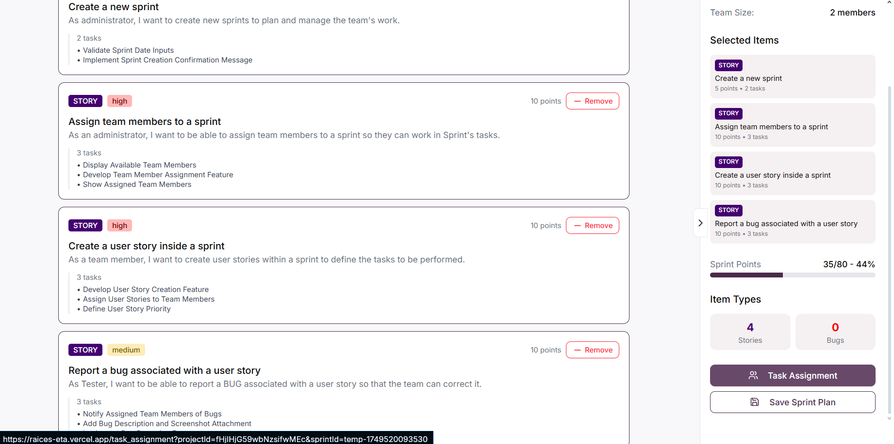

### Vista de asignación detallada

En la vista de "**_Detailed Task Assignment_**" podrá gestionar la asignación individual de tareas a los miembros del equipo.

Vista de asignación detallada
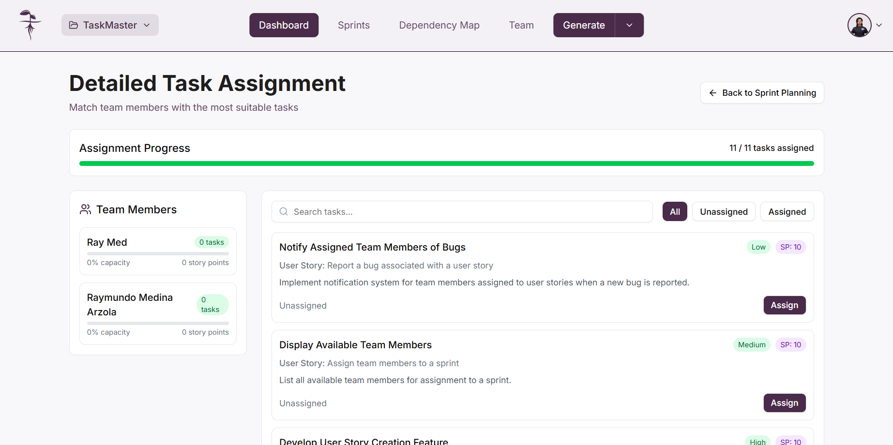

### Asignar tareas a miembros

Para asignar una tarea específica a un miembro del equipo, de click en el botón "**_Assign_**" correspondiente a la tarea deseada.

Botón "**_Assign_**" en tarea
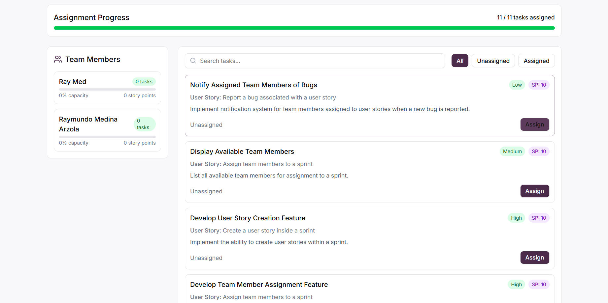

Ventana de asignación a miembros
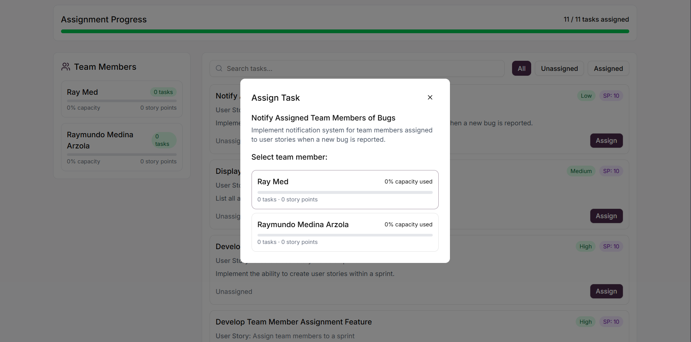

### Buscar y filtrar tareas

Puede buscar tareas específicas usando la barra de búsqueda "**_Search tasks..._**"

Barra de búsqueda de tareas
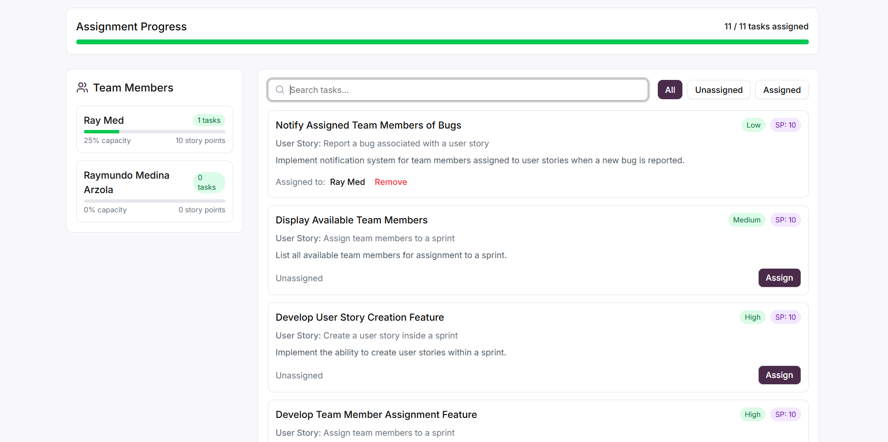

Para filtrar por el estado de asignación, use los botones:
- "**_All_**": Mostrar todas las tareas
- "**_Unassigned_**": Mostrar solo tareas no asignadas
- "**_Assigned_**": Mostrar solo tareas asignadas

Filtros de estado de asignación
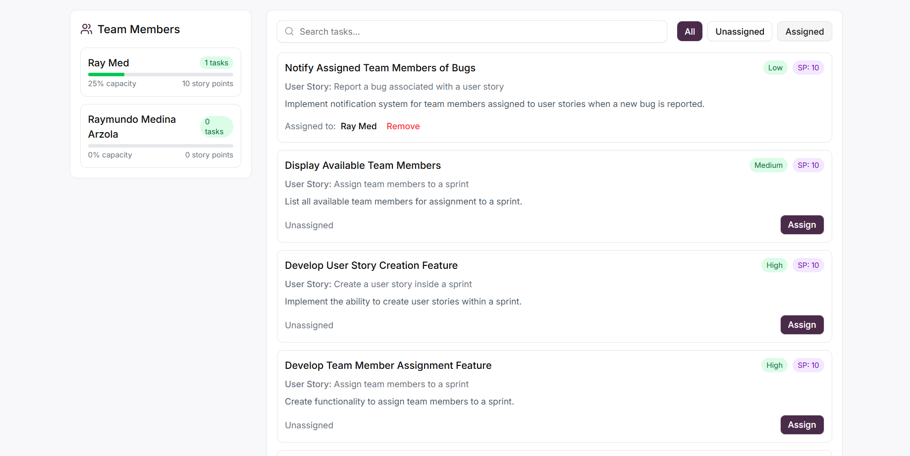

### Monitoreo de capacidad del equipo

Durante la asignación de tareas, podrá ver una barra de progreso en la sección "**_Team Members_**" sobre cada miembro, esta representa el límite de capacidad (Team Capacity) que definió inicialmente. Esta barra le mostrará si sobrepasa los valores esperados o si está dentro del rango adecuado.

Barra de capacidad del equipo
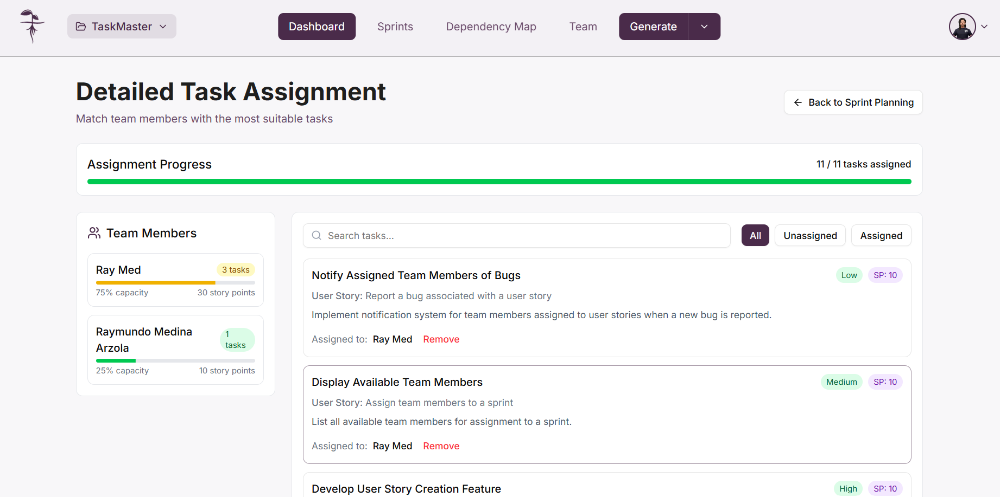

## Finalizar la asignación

### Completar asignación y regresar a la planeación

Una vez haya terminado de asignar las tareas a su equipo, de click en "**_Complete Assignment & Return to Planning_**" lo cuál llevará a la sección sobre [Las posibles](#opciones-de-asignación).

Botón "**_Complete Assignment & Return to Planning_**"
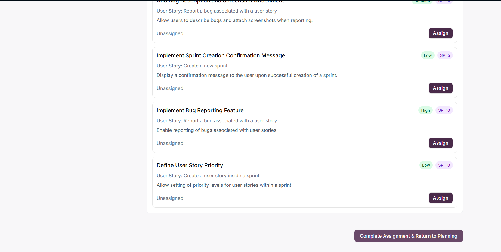

### Opciones de Asignación

#### Asignación normal vs. biométrica

Al realizar la asignación de tareas, el sistema le preguntará cómo desea proceder con la asignación. Tiene dos opciones:

Popup de selección de método de asignación
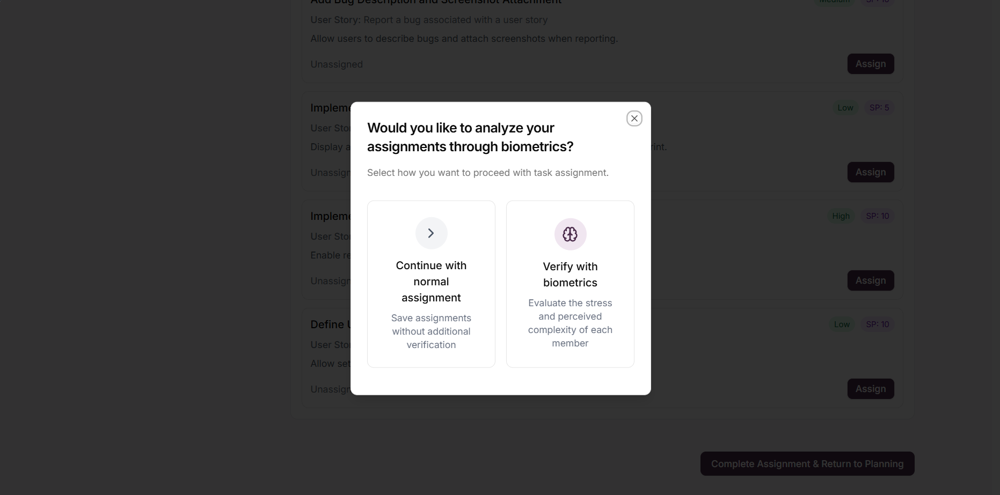

##### Continuar con asignación normal

Seleccione "**_Continue with normal assignment_**" para guardar las asignaciones sin verificación adicional.

##### Verificar con biométricos

Seleccione "**_Verify with biometrics_**" para evaluar el estrés y la complejidad percibida de cada miembro del equipo antes de finalizar las asignaciones. [Obtenga más información aquí](BiometricsAssignment.md)

### Regresar sin guardar

Si desea regresar a la vista de planeación sin guardar los cambios, use el botón "**_Back to Sprint Planning_**"

Botón "**_Back to Sprint Planning_**"
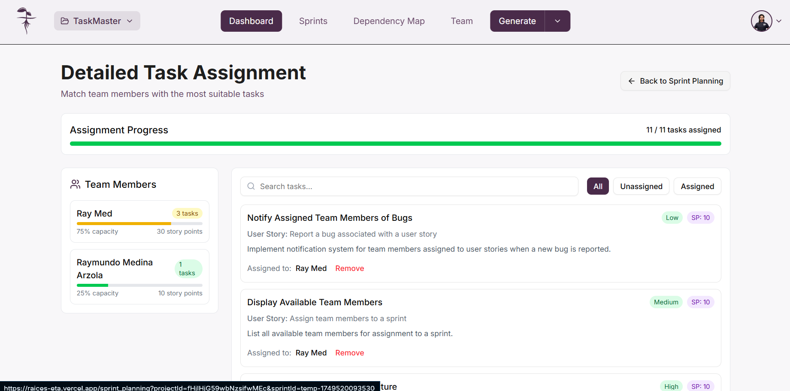

## Guardar el Sprint Plan

### Finalizar y guardar el sprint

Una vez haya terminado toda la configuración y asignación de tareas, podrá guardar el sprint plan usando el botón "**_Save Sprint Plan_**"

Botón "**_Save Sprint Plan_**"
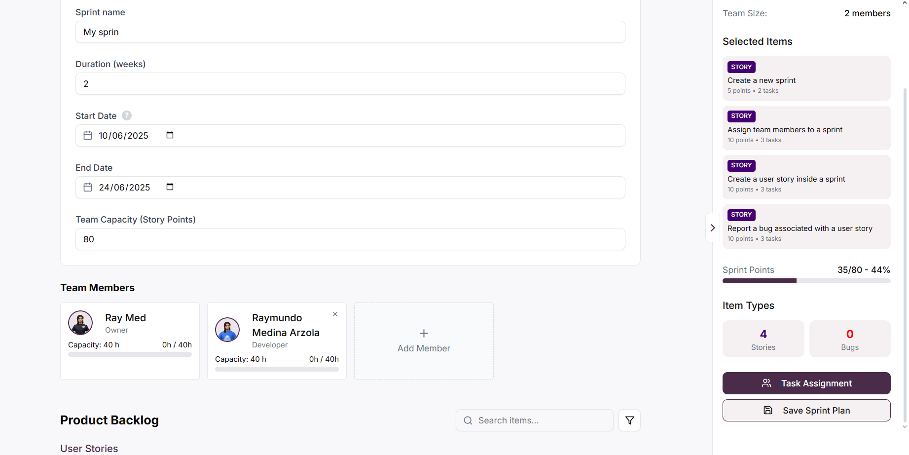

:::info Progreso del Sprint

En la sección "**_Sprint Points_**" podrá ver el progreso de puntos de historia asignados versus la capacidad total del equipo, representado tanto en números como en una barra de progreso visual

:::

:::note Importante

Asegúrese de que todas las tareas críticas estén asignadas y que la capacidad del equipo esté balanceada antes de guardar el sprint plan

:::

