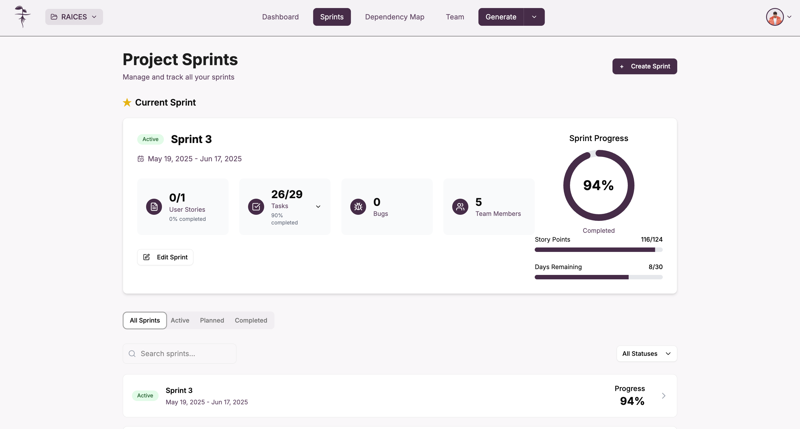
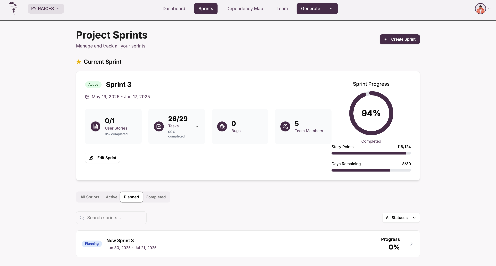
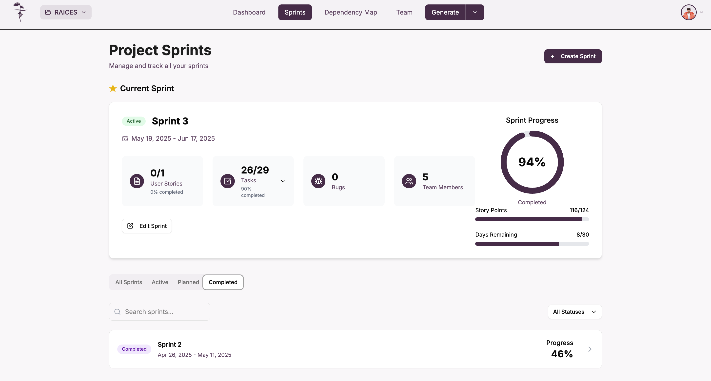

Para acceder a la visualización de sprints de un proyecto, primero debe seleccionar el proyecto deseado desde la vista principal de proyectos y navegar a la sección de **_Sprints_**.

## Acceso a los sprints del proyecto

En la navegación principal de la aplicación, seleccione la opción **"Sprints"** para acceder a la gestión completa de todos los sprints del proyecto.

## Vista principal de sprints

### Información general del proyecto

La vista principal de sprints muestra el título del proyecto junto con una descripción, proporcionando una interfaz centralizada para la gestión de todos los sprints del proyecto.

### Sprint actual destacado

En la parte superior se destaca la sección del sprint actual, mostrando el sprint actualmente activo con toda su información relevante.

### Métricas del sprint actual

El sprint actual muestra métricas clave incluyendo:
- **User Stories**: Cantidad completada vs total
- **Tasks**: Progreso de tareas con porcentaje de completitud
- **Bugs**: Número de bugs encontrados
- **Team Members**: Cantidad de miembros del equipo

### Panel de progreso visual

En el lado derecho se muestra un gráfico circular de progreso que indica:
- **Porcentaje de completitud**: Progreso general del sprint
- **Story Points**: Progreso de puntos de historia
- **Days Remaining**: Días restantes del sprint

### Botón de edición

Cada sprint incluye un botón **"Edit Sprint"** que permite modificar los detalles y configuración del sprint seleccionado.

## Estados de visualización de sprints

### Filtros por estado

La interfaz incluye filtros para visualizar sprints según su estado actual:
- **All Sprints**: Muestra todos los sprints del proyecto
- **Active**: Sprints actualmente en ejecución
- **Planned**: Sprints planificados para futuras iteraciones
- **Completed**: Sprints que han sido finalizados

### Sprint activo

Los sprints en estado **"Active"** se muestran con:
- **Etiqueta de estado**: Indicador visual del estado actual
- **Fechas del sprint**: Rango de fechas de inicio y fin
- **Métricas en tiempo real**: Progreso actualizado de todas las métricas
- **Gráfico de progreso**: Visualización circular del avance general

### Sprint en planeación

Los sprints en estado **"Planned"** presentan:
- **Etiqueta de planificación**: Indicador de estado de planificación
- **Fechas programadas**: Fechas planificadas para el sprint
- **Progreso inicial**: Métricas iniciales antes del inicio
- **Configuración pendiente**: Elementos preparándose para ejecución

### Sprint completado

Los sprints en estado **"Completed"** muestran:
- **Etiqueta de completado**: Indicador de finalización exitosa
- **Fechas históricas**: Rango de fechas en que se ejecutó
- **Métricas finales**: Resultados definitivos del sprint
- **Progreso completo**: Porcentaje final alcanzado

## Búsqueda y filtrado

### Barra de búsqueda

La interfaz incluye una barra de búsqueda que permite localizar sprints específicos por nombre o características.

### Filtro de estados

Un dropdown permite filtrar la visualización según el estado deseado de los sprints.

## Lista de sprints

### Vista de tarjetas

Debajo del sprint actual destacado, se muestra una lista de todos los sprints del proyecto en formato de tarjetas que incluyen:
- **Estado del sprint**: Etiqueta visual según el estado
- **Nombre del sprint**: Identificación clara
- **Fechas**: Rango de fechas de cada sprint
- **Progreso**: Porcentaje de avance visual
- **Acceso a detalles**: Navegación hacia información detallada

Y al hacer click y seleccionar alguno se puede acceder a él y modificar sus datos.

## Creación de nuevos sprints

### Botón de creación

En la parte superior se encuentra el botón de creación que permite iniciar el proceso de creación de un nuevo sprint para el proyecto.

## Funcionalidades principales

### Gestión completa de sprints
- **Visualización centralizada** de todos los sprints del proyecto
- **Estados diferenciados** con indicadores visuales claros
- **Métricas en tiempo real** para sprints activos
- **Filtrado avanzado** por estado y búsqueda textual
- **Creación rápida** de nuevos sprints

### Métricas de seguimiento
- **User Stories**: Seguimiento de historias de usuario
- **Tasks**: Progreso de tareas técnicas
- **Bugs**: Conteo de defectos encontrados
- **Team Members**: Gestión del equipo asignado
- **Story Points**: Estimación y progreso de puntos
- **Days Remaining**: Control de tiempo restante

### Estados de sprint soportados
- **Active**: Sprint actualmente en ejecución
- **Planned**: Sprint programado para el futuro
- **Completed**: Sprint finalizado exitosamente

:::info Seguimiento eficiente

La vista de sprints se actualiza automáticamente para reflejar el progreso más reciente de todos los elementos, facilitando la toma de decisiones durante la gestión ágil del proyecto.

:::

:::tip Mejores prácticas

- Revise regularmente las métricas del sprint actual para identificar posibles bloqueos
- Utilice los filtros por estado para enfocarse en sprints específicos
- Mantenga actualizado el progreso de tasks y user stories
- Planifique los próximos sprints con anticipación usando el estado correspondiente

:::
