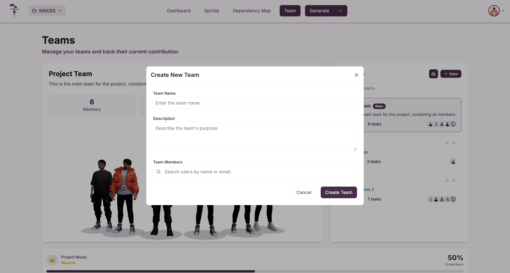
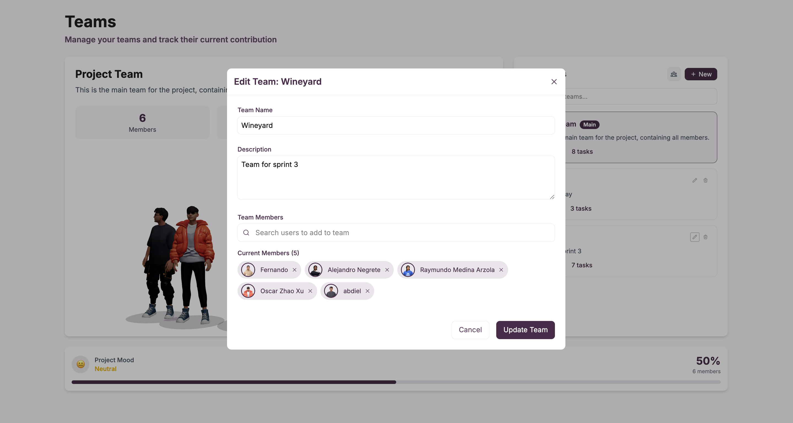
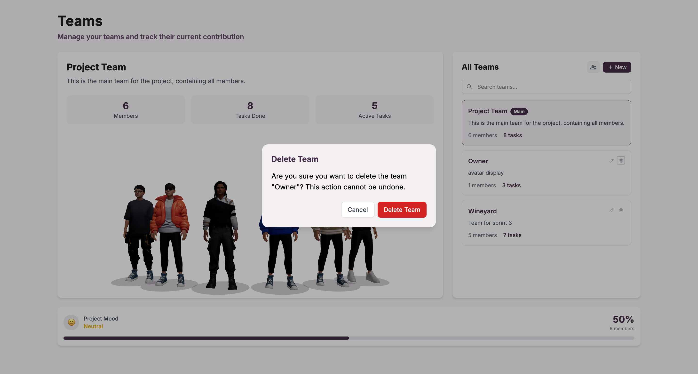

Para gestionar los equipos del proyecto, debe acceder a la sección **"Team"** desde el menú principal donde podrá crear nuevos equipos, editar equipos existentes y eliminar equipos según las necesidades del proyecto.

## Acceso a la gestión de equipos

Navegue a la sección **"Team"** desde el menú principal del proyecto para acceder a todas las funcionalidades de gestión de equipos.

## Vista principal de Teams

### Información general

La vista principal de Teams presenta:
- **Título de la sección**: "Teams"
- **Descripción del propósito**: "Manage your teams and track their current contribution"
- **Equipo principal**: Project Team que se genera automáticamente con todos los miembros del proyecto

### Equipo por defecto

Al crear un proyecto, automáticamente se genera un equipo principal llamado **"Project Team"** que incluye:
- **Todos los miembros del proyecto**: Contiene a todos los usuarios asignados al proyecto
- **Métricas básicas**: Número de miembros, tareas completadas y tareas activas
- **Estado del equipo**: Información sobre el rendimiento general

## Crear nuevo equipo

### Proceso de creación

Para crear un nuevo equipo específico dentro del proyecto:

1. Haga clic en **"+ New"** desde la vista principal de Teams
2. Complete el formulario de creación del equipo
3. Agregue los miembros deseados del proyecto
4. Confirme la creación

### Campos del formulario

El formulario de creación incluye:

#### Información básica
- **Team Name**: Nombre identificativo del equipo (obligatorio)
- **Description**: Descripción del propósito y contexto del equipo

#### Gestión de miembros
- **Team Members**: Barra de búsqueda para encontrar usuarios por nombre o email
- **Search users by name or email**: Funcionalidad de búsqueda de miembros disponibles

### Confirmación de creación

Una vez completados los campos:
- **Cancel**: Para cancelar la creación del equipo
- **Create Team**: Para confirmar y crear el nuevo equipo

## Editar equipos existentes

### Modificación de equipos

Para editar un equipo existente, haga clic en el ícono de edición en la lista de equipos disponibles.

### Campos editables

En el formulario de edición puede modificar:

#### Información del equipo
- **Team Name**: Cambiar el nombre del equipo
- **Description**: Actualizar la descripción y propósito del equipo

#### Gestión de miembros
- **Search users to add to team**: Agregar nuevos miembros al equipo
- **Current Members**: Lista de miembros actuales con opción de remover

### Miembros actuales

La sección de miembros actuales muestra:
- **Lista de miembros**: Todos los usuarios actualmente en el equipo
- **Opción de remover**: Botón "X" para quitar miembros del equipo
- **Contador**: Número total de miembros actuales

### Guardar cambios

Para confirmar las modificaciones:
- **Cancel**: Descartar los cambios realizados
- **Update Team**: Guardar las modificaciones del equipo

## Eliminar equipos

### Proceso de eliminación

Para eliminar un equipo del proyecto:

1. Haga clic en el ícono de eliminación en la lista de equipos
2. Confirme la eliminación en el diálogo de confirmación
3. El equipo será removido permanentemente del proyecto

### Confirmación de eliminación

El sistema muestra un diálogo de confirmación que incluye:
- **Título**: "Delete Team"
- **Mensaje de confirmación**: Verificación del equipo a eliminar con su nombre
- **Advertencia**: "This action cannot be undone"
- **Opciones**: "Cancel" para cancelar o "Delete Team" para confirmar la eliminación

## Características de los equipos

### Funcionalidades principales

- **Gestión completa**: Crear, editar y eliminar equipos específicos
- **Organización flexible**: Crear equipos basados en roles, sprints o funcionalidades
- **Gestión de miembros**: Agregar y remover miembros según las necesidades
- **Búsqueda avanzada**: Encontrar usuarios por nombre o email
- **Validación**: Confirmación antes de acciones destructivas

### Tipos de equipos

- **Project Team**: Equipo principal generado automáticamente con todos los miembros
- **Equipos específicos**: Equipos personalizados creados según las necesidades del proyecto
- **Equipos por sprint**: Organización temporal para sprints específicos
- **Equipos por funcionalidad**: Agrupación por áreas de trabajo

:::info Equipo principal

El "Project Team" se crea automáticamente al crear el proyecto e incluye a todos los miembros. Este equipo no puede ser eliminado ya que representa la estructura base del proyecto.

:::

:::tip Organización eficiente

Use nombres descriptivos para sus equipos y mantenga actualizadas las descripciones para facilitar la identificación del propósito de cada equipo. Considere crear equipos específicos para diferentes sprints o áreas funcionales.

:::