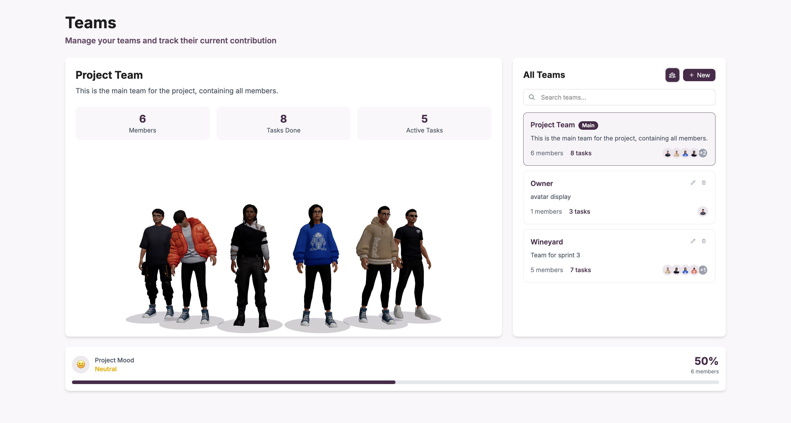
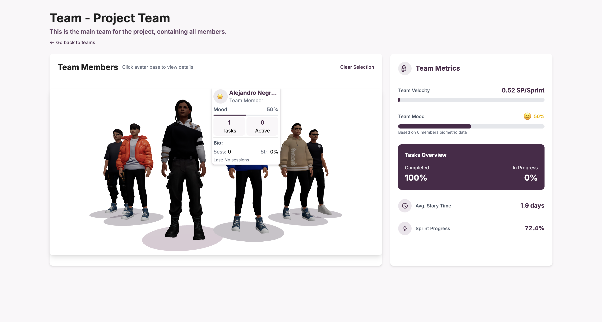

Una vez creados los equipos en el proyecto, puede visualizar información detallada sobre el rendimiento, métricas y estado emocional de los miembros del equipo a través de diferentes vistas especializadas.

## Acceso a la visualización

Desde la vista principal de Teams, puede acceder a la información detallada de cualquier equipo haciendo clic en el nombre del equipo o seleccionándolo de la lista de equipos disponibles.

## Vista principal de equipos

### Información general del proyecto

La vista principal muestra todos los equipos disponibles en el proyecto con información resumida de cada uno.

### Equipo principal del proyecto

#### Métricas del Project Team
El equipo principal muestra:
- **Members**: Número total de miembros del equipo
- **Tasks Done**: Cantidad de tareas completadas
- **Active Tasks**: Número de tareas actualmente activas

#### Representación visual
- **Avatares de miembros**: Visualización de los avatares 3D de cada miembro del equipo
- **Project Mood**: Estado emocional general del equipo con porcentaje
- **Barra de progreso**: Indicador visual del estado general del equipo

### Panel de equipos específicos

#### Lista de equipos
En el panel **"All Teams"** se muestran:
- **Barra de búsqueda**: "Search teams..." para localizar equipos específicos
- **Lista de equipos**: Todos los equipos creados con información resumida
- **Botón de creación**: "+ New" para crear nuevos equipos

#### Información de cada equipo
Cada equipo en la lista muestra:
- **Nombre del equipo**: Identificación clara con etiquetas especiales (ej. "Main")
- **Descripción**: Propósito del equipo
- **Métricas básicas**: Número de miembros y tareas asignadas
- **Avatares**: Representación visual de los miembros

## Vista detallada del equipo

### Acceso a detalles

Para ver información detallada de un equipo específico, haga clic en el nombre del equipo desde la vista principal.

### Información del encabezado

#### Título y descripción
- **Nombre del equipo**: "Team - Project Team"
- **Descripción**: Propósito y contexto del equipo
- **Navegación**: Enlace "Go back to teams" para regresar a la vista principal

### Sección de miembros del equipo

#### Team Members
La sección principal muestra:
- **Título**: "Team Members" con instrucción "Click avatar base to view details"
- **Opción de limpieza**: "Clear Selection" para deseleccionar miembros
- **Representación visual**: Avatares 3D interactivos de todos los miembros

#### Información individual de miembros
Al seleccionar un miembro se muestra:
- **Nombre del miembro**: Identificación completa
- **Rol**: "Team Member" u otro rol asignado
- **Estado emocional (Mood)**: Porcentaje y indicador visual del estado de ánimo
- **Métricas de tareas**: Número de tareas asignadas y activas
- **Información biométrica**: Datos de sesiones y estrés cuando están disponibles

### Panel de métricas del equipo

#### Team Metrics
El panel lateral derecho incluye:

##### Velocidad del equipo
- **Team Velocity**: Medida en "SP/Sprint" (Story Points por Sprint)
- **Valor actual**: Rendimiento promedio del equipo

##### Estado emocional del equipo
- **Team Mood**: Porcentaje general basado en datos biométricos
- **Indicador visual**: Emoji y color representativo del estado
- **Base de datos**: "Based on X members biometric data"

##### Resumen de tareas
- **Tasks Overview**: Distribución de tareas del equipo
- **Completed**: Porcentaje de tareas completadas
- **In Progress**: Porcentaje de tareas en desarrollo
- **Progreso visual**: Representación gráfica del avance

##### Métricas adicionales
- **Avg. Story Time**: Tiempo promedio para completar historias
- **Sprint Progress**: Porcentaje de avance del sprint actual

## Análisis de datos biométricos

### Cálculo del Mood

El estado emocional (Mood) se calcula basándose en:
- **Datos biométricos**: Información recopilada durante las sesiones de trabajo
- **Respuestas emocionales**: Reacciones a las tareas asignadas durante el sprint planning
- **Análisis de estrés**: Evaluación del nivel de estrés percibido en las tareas
- **Adecuación a tareas**: Compatibilidad emocional con las tareas asignadas

### Indicadores de rendimiento

#### Métricas individuales
- **Sesiones biométricas**: Cantidad de datos recopilados por miembro
- **Nivel de estrés**: Porcentaje de estrés detectado
- **Tareas completadas**: Rendimiento individual

#### Métricas del equipo
- **Mood promedio**: Cálculo basado en todos los miembros con datos
- **Velocidad**: Story points completados por sprint
- **Progreso general**: Avance combinado del equipo

## Interacción con avatares

### Funcionalidades interactivas

#### Selección de miembros
- **Click en avatar**: Seleccionar un miembro específico para ver detalles
- **Clear Selection**: Deseleccionar para ver información general
- **Vista múltiple**: Posibilidad de comparar métricas entre miembros

#### Información contextual
- **Detalles en tiempo real**: Información actualizada automáticamente
- **Estado visual**: Los avatares reflejan el estado emocional actual
- **Navegación intuitiva**: Fácil acceso a la información de cada miembro

## Navegación y controles

### Herramientas de vista

La interfaz incluye controles para:
- **Búsqueda de equipos**: Localizar equipos específicos por nombre
- **Navegación entre vistas**: Alternancia entre vista general y detallada
- **Filtros**: Organización de equipos según diferentes criterios
- **Actualización automática**: Sincronización de métricas en tiempo real

:::info Datos biométricos

El Mood y las métricas emocionales se basan en datos biométricos recopilados durante las sesiones de trabajo y el proceso de asignación de tareas. La precisión de estas métricas depende de la participación activa de los miembros en las sesiones biométricas.

:::

:::tip Gestión eficiente del equipo

Utilice la vista detallada para identificar miembros que puedan necesitar apoyo adicional basándose en sus métricas de estrés y estado emocional. El análisis de mood ayuda a tomar decisiones más informadas sobre la asignación de tareas.

:::